# 00 - Creating Our Server + Workstation Virtual Environment

## 🎯 Objective

Set up a local home lab environment using VMware Workstation Pro 17
to practice Active Directory security. This involves creating two
virtual machines:

- A **Windows Server 2022** machine → will become our Domain Controller (DC)
- A **Windows 11** machine → will act as a workstation/client

---

## 🛠️ Tools & Software Used

| Tool | Purpose |
|---|---|
| VMware Workstation Pro 17 | Virtualization platform to host our VMs |
| Windows Server 2022 ISO | OS for the Domain Controller (Server Core) |
| Windows 11 ISO | OS for the workstation |
| VMware Tools | Enhances VM performance and integration |

> 📥 Both ISOs were downloaded from the
> [Microsoft Evaluation Center](https://www.microsoft.com/en-us/evalcenter/)

---

## 🔬 Step-by-Step Walkthrough

### Step 1 — Create the Virtual Machines in VMware

Two VMs were created under a **Base Templates** folder inside VMware
Workstation Pro 17 with the following resource allocation:

| Virtual Machine | Role | RAM | Processors | Storage |
|---|---|---|---|---|
| Base WinServer 2022 | Domain Controller (DC) | 8 GB | 4 | 100 GB NVMe |
| Base Win11 Workstation | Workstation / Client | 8 GB | 4 | 100 GB NVMe |

Both VMs were grouped under **XYZ Domain** for organization.

> 💡 **Why organize VMs into groups/folders?**
> When building a full AD lab with multiple machines (DC + multiple
> workstations), grouping them keeps VMware tidy and lets you
> start/stop the entire lab environment at once.

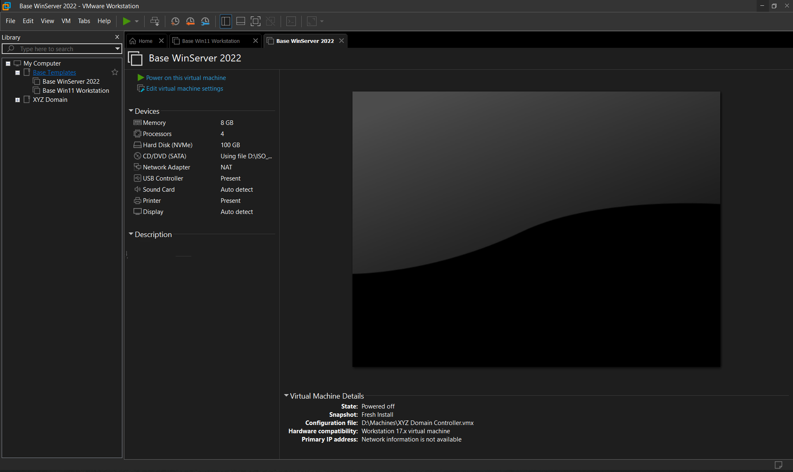
*VMware Workstation library showing Base WinServer 2022 and
Base Win11 Workstation under the XYZ Domain group*

---

### Step 2 — Configure VM Hardware

Each VM was configured with appropriate hardware resources before
OS installation.

**Domain Controller (Base WinServer 2022):**

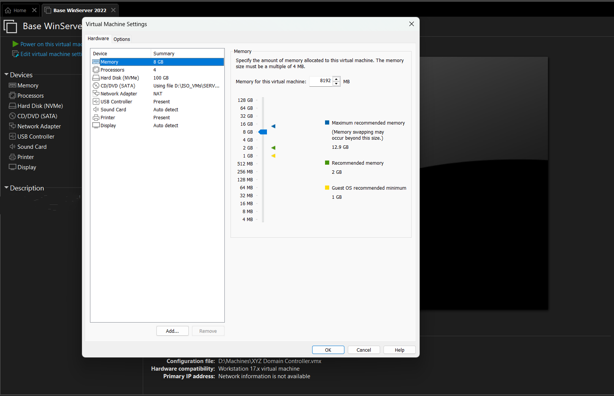
*Virtual Machine Settings for the Domain Controller —
8 GB RAM, 4 processors, 100 GB NVMe disk, NAT network*

**Workstation (Base Win11 Workstation):**

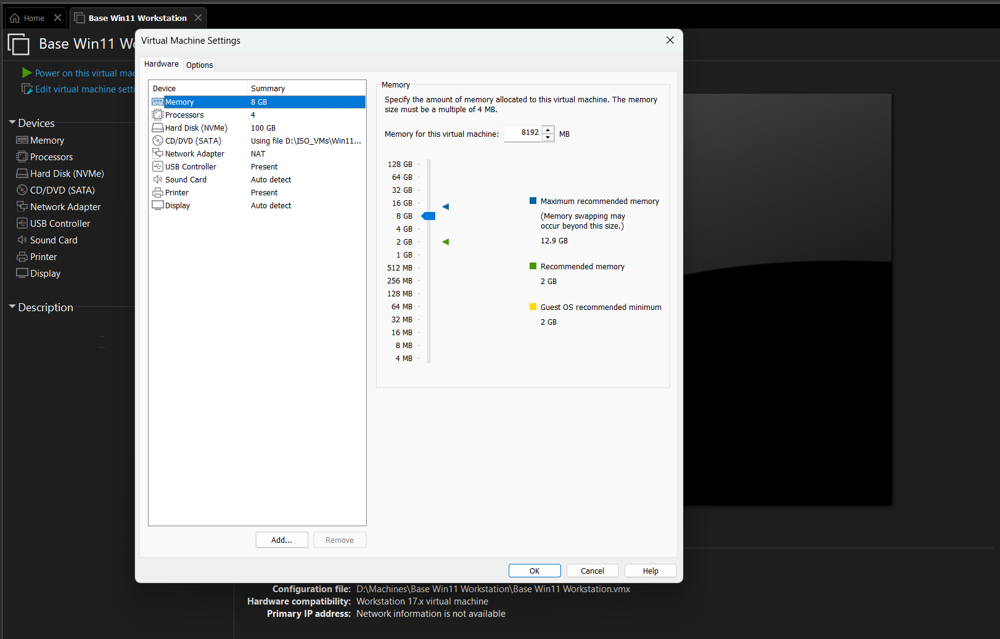
*Virtual Machine Settings for the Windows 11 Workstation —
8 GB RAM, 4 processors, 100 GB NVMe disk, NAT network*

**Network Configuration (NAT):**

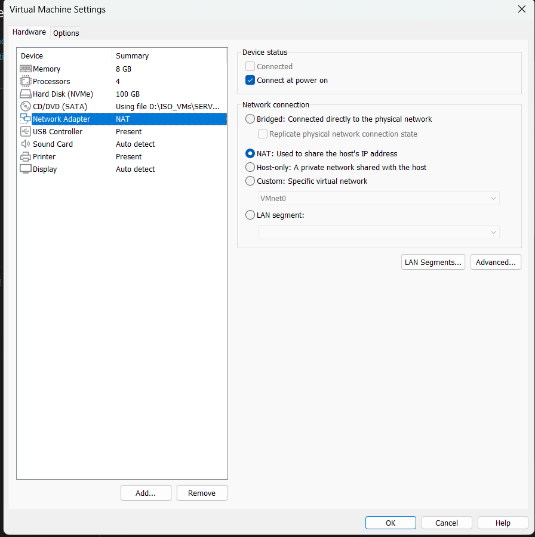
*Both VMs use NAT networking — this allows the VMs to share the
host machine's internet connection while remaining isolated*

> 💡 **Why NAT for the lab?**
> NAT (Network Address Translation) lets VMs access the internet
> for downloads/updates while keeping them on a private subnet
> separate from your physical network. This is ideal for a lab
> environment.

---

### Step 3 — Install Windows Server 2022 (Server Core)

Windows Server 2022 was installed using the **Server Core** option —
a minimal installation with no GUI (graphical user interface).

After booting, the Server Core environment presents a PowerShell
terminal as the primary interface:

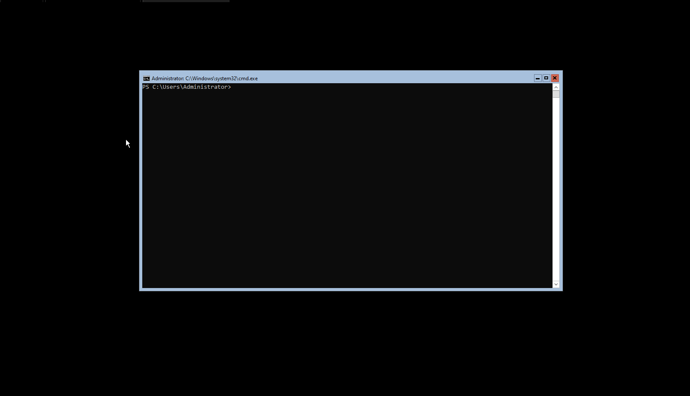
*Windows Server 2022 Server Core — the entire OS is managed
through this PowerShell/CMD terminal with no desktop GUI*

Running `sconfig` launches the Server Configuration menu — a
text-based tool to manage core server settings:

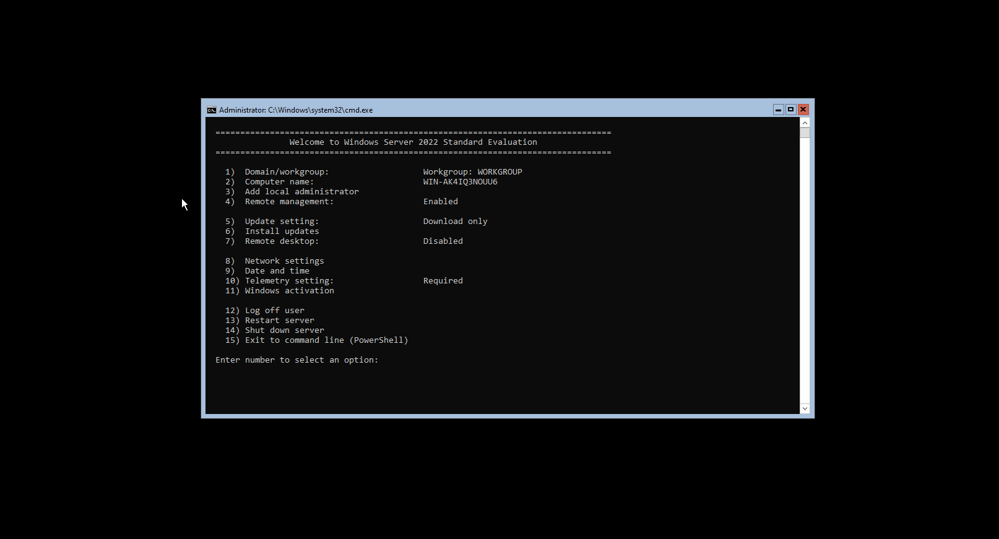
*The `sconfig` menu on Windows Server 2022 — used to configure
hostname, network, remote management, and updates*

> 💡 **Why Server Core?**
> Server Core reduces the **attack surface** of the Domain Controller.
> With no GUI, there are fewer running services and fewer installed
> components — meaning fewer potential vulnerabilities. This mirrors
> real-world enterprise Domain Controller deployments.

Verifying the current network configuration with `ipconfig`:

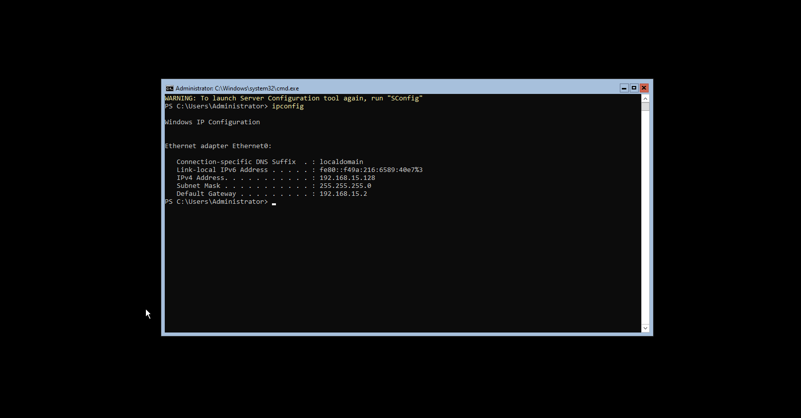
*`ipconfig` output on the DC — currently assigned a DHCP address
of `192.168.15.128`. This will be changed to a static IP in Chapter 1.*

Verifying the hostname with `hostname`:

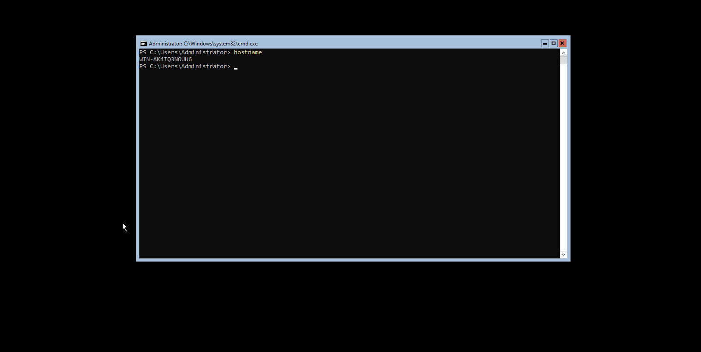
*`hostname` shows the default auto-generated name `WIN-AK4IQ3NOUU6`.
This will be renamed to a proper DC hostname in Chapter 1.*

---

### Step 4 — Install Windows 11 (TPM Bypass)

Windows 11 enforces strict hardware requirements that virtual
machines often don't meet by default:

- TPM 2.0
- Secure Boot
- Minimum RAM check

To bypass these checks during installation, the following registry
edits were applied by pressing `Shift + F10` during setup to open
a Command Prompt, then running `regedit`:
```reg
[HKEY_LOCAL_MACHINE\SYSTEM\Setup\LabConfig]
"BypassTPMCheck"=dword:00000001
"BypassSecureBootCheck"=dword:00000001
"BypassRAMCheck"=dword:00000001
```

> 💡 **Step-by-step TPM bypass:**
> 1. Boot the Windows 11 ISO in VMware
> 2. When you see "This PC can't run Windows 11", press `Shift + F10`
> 3. Type `regedit` → Navigate to `HKEY_LOCAL_MACHINE\SYSTEM\Setup`
> 4. Create a new key: `LabConfig`
> 5. Add three DWORD (32-bit) values as shown above

---

### Step 5 — Post-Install Configuration (Windows 11)

After installation, the following configurations were applied:

- **VMware Tools** installed for better display resolution,
  clipboard sharing, and drag-and-drop functionality
- A **local admin account** (`local_admin`) was created
  **without** linking a Microsoft account

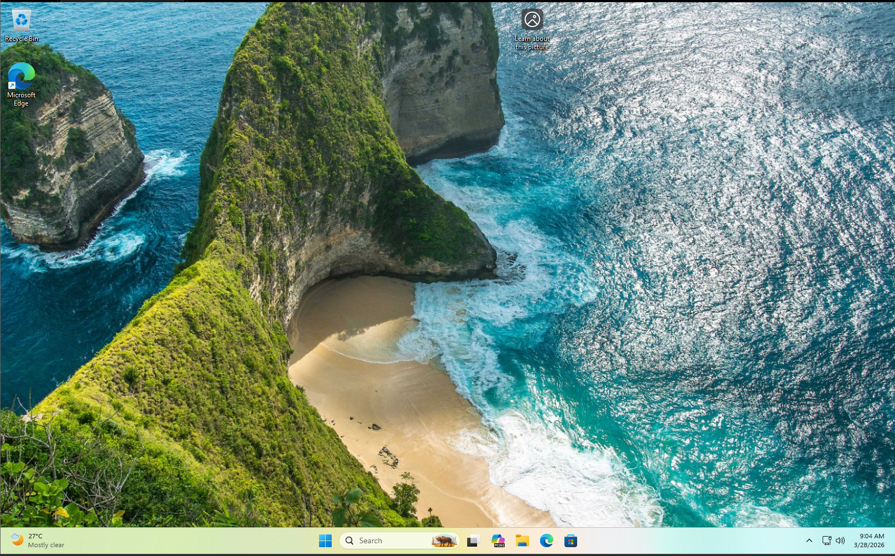
*Clean Windows 11 Pro N for Workstations desktop — running as
`local_admin` local account with no Microsoft account linked*

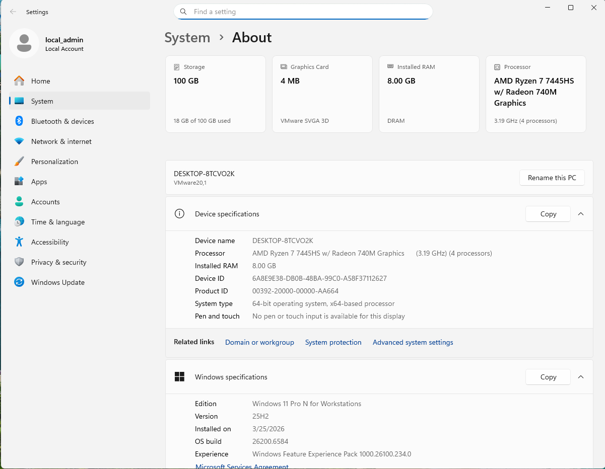
*System → About page confirming: Windows 11 Pro N for Workstations
(Version 25H2), 8 GB RAM, Device name: `DESKTOP-8TCVO2K`,
logged in as `local_admin` (Local Account)*

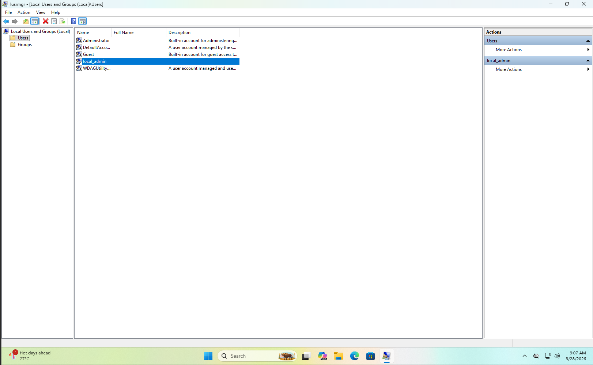
*`lusrmgr.msc` showing local users — `local_admin` was created
as the primary lab account without a Microsoft account*

> 💡 **Why avoid a Microsoft account?**
> In a penetration testing lab, machines should be isolated from
> personal accounts and the internet. A local account keeps the
> environment self-contained and controlled.

---

### Step 6 — Snapshots

After completing the base installations on both VMs, **snapshots**
were taken to preserve the clean state for future use.

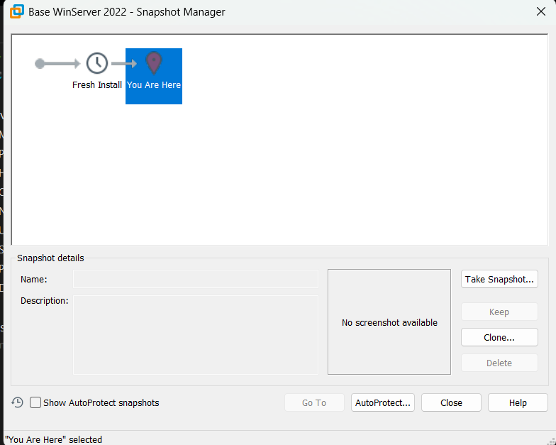
*Snapshot Manager for Base WinServer 2022 — `Fresh Install`
snapshot taken immediately after OS installation*

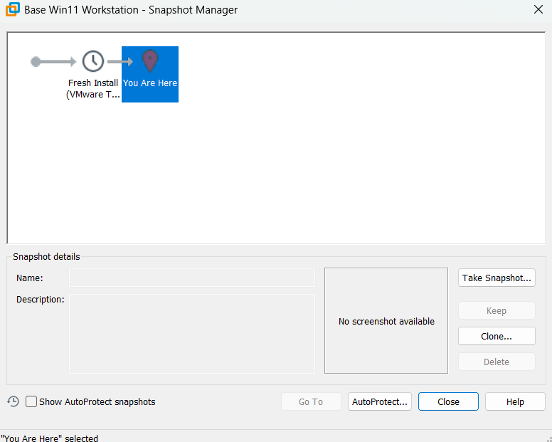
*Snapshot Manager for Base Win11 Workstation — `Fresh Install`
snapshot taken after OS install and VMware Tools setup*

> 💡 **Why take snapshots?**
> Snapshots act as **save points**. If a lab exercise breaks the
> machine, you can instantly revert to this clean state without
> reinstalling the OS. Always snapshot after a fresh install
> before making any changes.

---

## 🖼️ Screenshots Summary

| # | File | Description |
|---|---|---|
| 1 | `screenshots/01-vmware-library.png` | VMware library with both VMs in XYZ Domain group |
| 2 | `screenshots/02-dc-hardware-settings.png` | DC VM hardware: 8GB RAM, 4 CPUs, 100GB NVMe |
| 3 | `screenshots/03-ws-hardware-settings.png` | Workstation VM hardware: 8GB RAM, 4 CPUs |
| 4 | `screenshots/04-dc-snapshot.png` | DC Fresh Install snapshot |
| 5 | `screenshots/05-ws-snapshot.png` | Workstation Fresh Install snapshot |
| 6 | `screenshots/06-network-adapter.png` | NAT network adapter configuration |
| 7 | `screenshots/07-server-core-terminal.png` | Server Core PowerShell terminal |
| 8 | `screenshots/08-sconfig-menu.png` | sconfig server configuration menu |
| 9 | `screenshots/09-dc-ipconfig.png` | DC network info (DHCP: 192.168.15.128) |
| 10 | `screenshots/10-dc-hostname.png` | DC default hostname: WIN-AK4IQ3NOUU6 |
| 11 | `screenshots/11-win11-desktop.png` | Windows 11 clean desktop |
| 12 | `screenshots/12-win11-system-info.png` | Win11 system info — local_admin account |
| 13 | `screenshots/13-local-users.png` | Local users showing local_admin account |

---

## 🧩 Key Takeaways

- A **Domain Controller** is the heart of Active Directory — it
  handles authentication, DNS, and directory services for the domain.
- **Server Core** is preferred in real environments as it minimizes
  the attack surface by removing the GUI.
- **NAT networking** in VMware lets lab VMs access the internet while
  staying isolated from the physical network.
- **TPM bypass via registry** (`LabConfig` keys) is the standard
  method to install Windows 11 on unsupported or virtual hardware.
- **Snapshots** are essential — always take one after a clean install
  before making any changes to your lab.
- Using a **local account** (not Microsoft account) keeps your lab
  environment isolated and portable.

---

## ➡️ Next Chapter

[Chapter 1 — Installing the Domain Controller](../Chapter-1/README.md)