# 01 - Joining a Home Lab Domain (Installing the Domain Controller)

## 🎯 Objective

Configure the Windows Server 2022 VM as a fully functioning
**Active Directory Domain Controller** for the `xyz.com` domain,
then join the Windows 11 workstation to that domain.

This chapter covers:
- Enabling remote management via PS Remoting
- Renaming the server and assigning a static IP using `sconfig`
- Installing the AD DS role via PowerShell
- Promoting the server to a Domain Controller
- Joining the Windows 11 workstation to the domain

---

## 🛠️ Tools & Concepts Used

| Tool / Concept | Purpose |
|---|---|
| `sconfig` | Text-based server configuration menu |
| PowerShell | Primary interface for Server Core management |
| `Install-WindowsFeature` | PowerShell cmdlet to install Windows roles |
| AD DS (Active Directory Domain Services) | The core role that makes a server a DC |
| `Install-ADDSForest` | Promotes a server to DC by creating a new forest |
| PS Remoting / Trusted Hosts | Enables remote PowerShell management |
| DNS | DC acts as DNS server for the domain |

---

## 🌐 Lab Network Configuration

| Machine | Role | IP Address | DNS |
|---|---|---|---|
| DC1 | Domain Controller | `192.168.15.155` (Static) | `192.168.15.155` (self) |
| DESKTOP-8TCVO2K | Workstation (WS01) | `192.168.15.132` (DHCP) | `192.168.15.155` (DC) |

> 💡 **Why does the DC point DNS to itself?**
> The Domain Controller runs its own DNS server. All machines in
> the domain must use the DC's IP as their DNS server so they can
> resolve domain names like `DC1.xyz.com`. If DNS is wrong, domain
> joining and authentication will fail.

---

## 🔬 Step-by-Step Walkthrough

### Step 1 — Enable PS Remoting (Remote Management Setup)

Before configuring the DC remotely, PS Remoting was enabled on
the server and the management client was configured with Trusted
Hosts to allow remote PowerShell sessions.

**On the Domain Controller (Server Core):**
```powershell
# Enable PowerShell Remoting
Enable-PSRemoting -Force
```

**On the management/client machine:**
```powershell
# Add the DC to the list of trusted hosts
Set-Item WSMan:\localhost\Client\TrustedHosts -Value "192.168.15.155"

# Verify trusted hosts
Get-Item WSMan:\localhost\Client\TrustedHosts
```

**To start a remote PowerShell session:**
```powershell
Enter-PSSession -ComputerName 192.168.15.155 -Credential Administrator
```

> 💡 **Why PS Remoting?**
> Since Windows Server 2022 is running as **Server Core** (no GUI),
> PS Remoting lets you manage the DC remotely from your workstation
> instead of typing everything directly on the server console.
> This mirrors real-world enterprise server management practices.

---

### Step 2 — Rename the Server Using `sconfig`

The default auto-generated hostname (`WIN-AK4IQ3NOUU6` from
Chapter 0) was renamed to `DC1` using the `sconfig` menu.
```powershell
# Launch the Server Configuration tool
sconfig
```

Inside `sconfig`:
- Select option **2** → Computer Name → Enter `DC1` → Restart

After restart, the hostname was confirmed:
```powershell
hostname
```

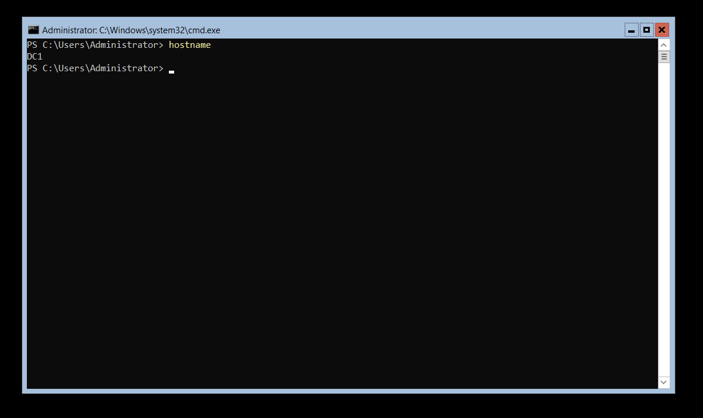
*`hostname` command confirming the server has been renamed to `DC1`*

---

### Step 3 — Set a Static IP Address Using `sconfig`

A static IP was configured to ensure the DC always has the same
address. Domain-joined machines need a reliable, fixed IP to
locate the DC for authentication and DNS.

Inside `sconfig`:
- Select option **8** → Network Settings
- Select the adapter → Set address type to **Static**
- Configure the following:

| Setting | Value |
|---|---|
| IP Address | `192.168.15.155` |
| Subnet Mask | `255.255.255.0` |
| Default Gateway | `192.168.15.2` |
| DNS Server | `192.168.15.155` ← points to itself |

Verified with `ipconfig /all`:
```powershell
ipconfig /all
```

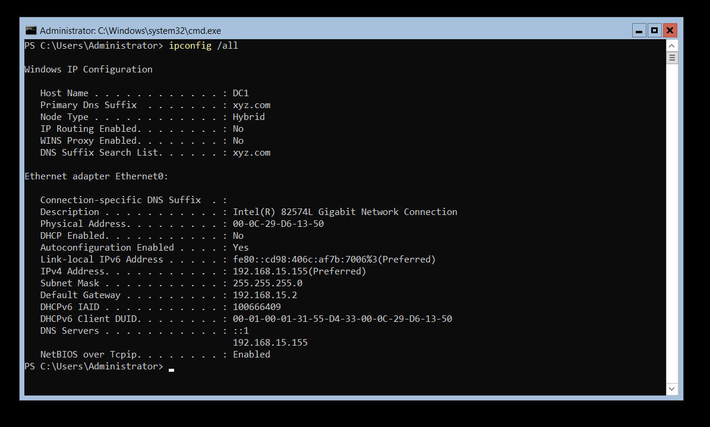
*`ipconfig /all` output confirming: static IP `192.168.15.155`,
DNS pointing to itself, DHCP disabled — Primary DNS Suffix shows
`xyz.com` confirming domain membership*

The `sconfig` menu after full configuration:

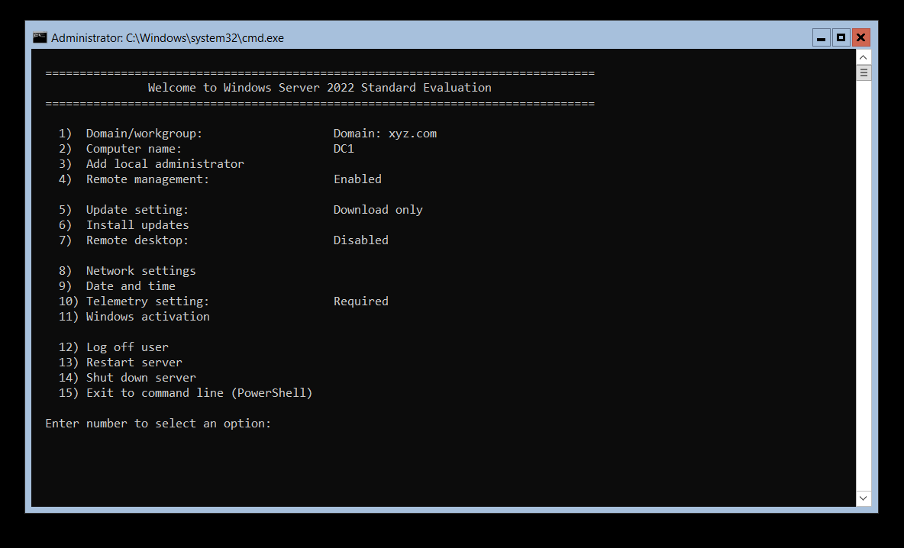
*`sconfig` menu confirming: Computer name = `DC1`,
Domain = `xyz.com`, Remote management = Enabled*

---

### Step 4 — Install the AD DS Role

With the server configured, the Active Directory Domain Services
(AD DS) role was installed using PowerShell:
```powershell
# Install AD Domain Services role with management tools
Install-WindowsFeature AD-Domain-Services -IncludeManagementTools
```

> ⚠️ **Note:** The original README had a typo `AD-Doamin-Services`.
> The correct command is `AD-Domain-Services` as shown above.

After installation, the role was verified:
```powershell
# Verify AD DS is installed
Get-WindowsFeature AD-Domain-Services
```

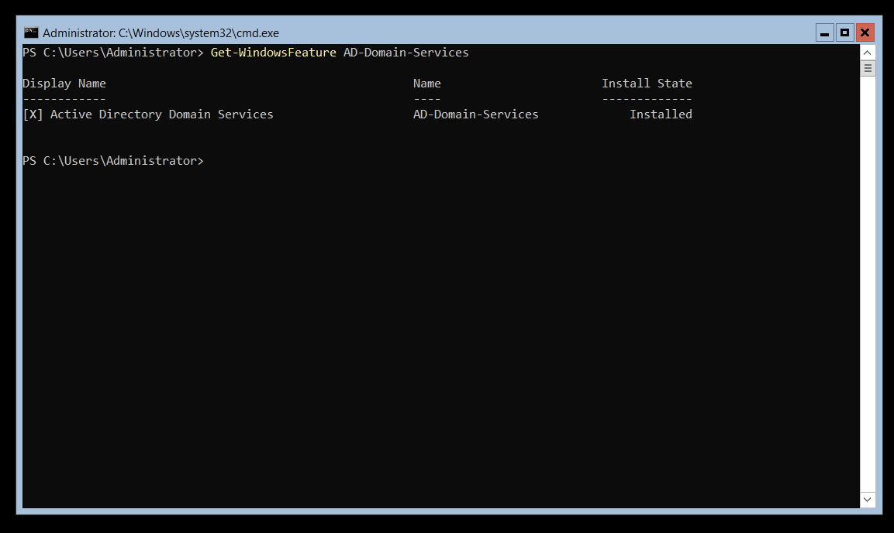
*`Get-WindowsFeature AD-Domain-Services` confirming
`[X] Active Directory Domain Services` is fully Installed*

---

### Step 5 — Promote the Server to a Domain Controller

Installing AD DS alone doesn't make it a Domain Controller —
the server must be **promoted** by creating a new AD forest:
```powershell
# Promote the server to a Domain Controller
# Creates a new forest with the domain name xyz.com
Install-ADDSForest -DomainName "xyz.com"
```

> 💡 **What is a Forest?**
> In Active Directory, a **forest** is the top-level container
> that holds one or more domains. By creating a new forest with
> `xyz.com`, we're building a brand new AD environment from scratch.
> The server will restart automatically after promotion.

After reboot, the domain was verified:
```powershell
# Confirm domain details
Get-ADDomain
```

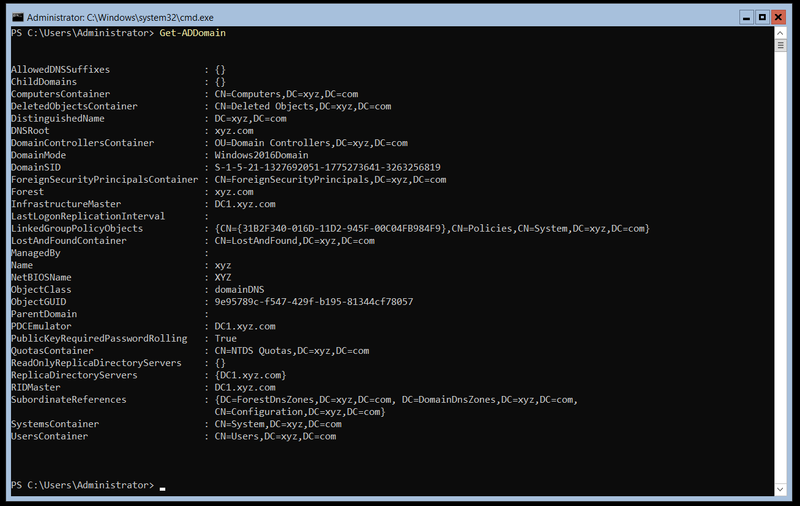
*`Get-ADDomain` output confirming the domain is fully operational:
`DNSRoot: xyz.com`, `Forest: xyz.com`,
`PDCEmulator: DC1.xyz.com`, `RIDMaster: DC1.xyz.com`*

Computers and users in the domain were also verified:
```powershell
# List all computers in the domain
Get-ADComputer -Filter *

# List all users in the domain
Get-ADUser -Filter *
```

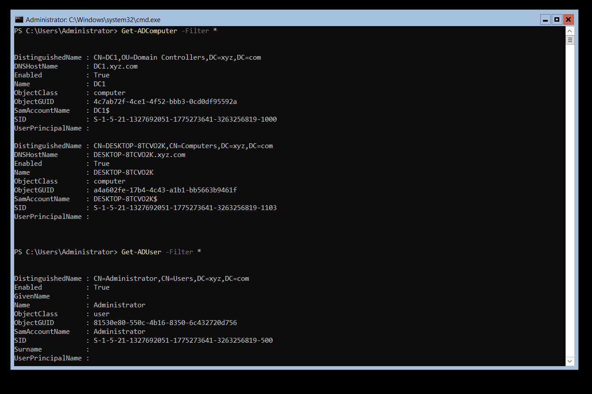
*`Get-ADComputer -Filter *` showing DC1 (Domain Controller) and
DESKTOP-8TCVO2K (workstation) — both registered in the domain.
`Get-ADUser -Filter *` showing domain user: Administrator*

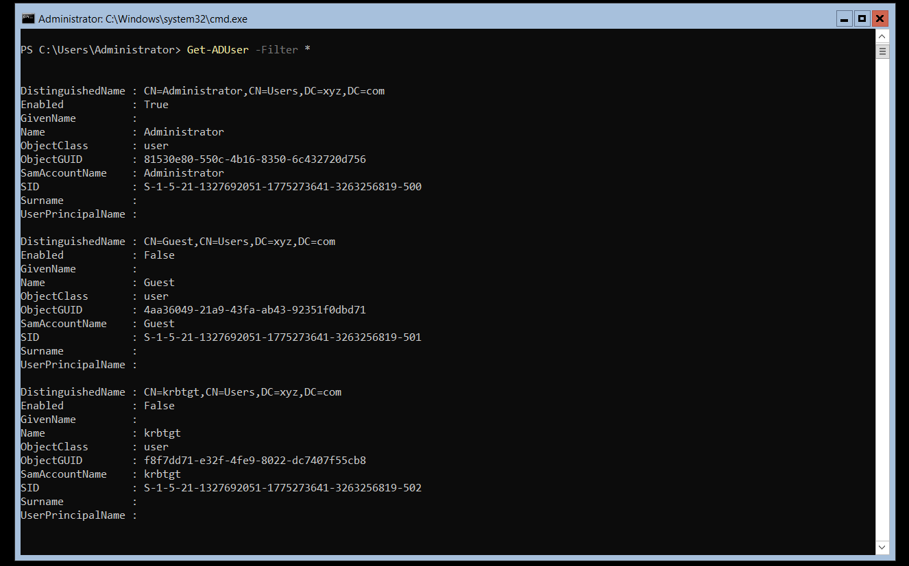
*Full `Get-ADUser -Filter *` output showing all default domain
accounts: `Administrator` (enabled), `Guest` (disabled),
`krbtgt` (disabled — used internally for Kerberos authentication)*

> 💡 **What is `krbtgt`?**
> The `krbtgt` account is a special built-in account used by the
> **Kerberos Key Distribution Center (KDC)**. It issues Kerberos
> tickets for authentication across the domain. It should always
> remain disabled for direct login — it's used only by the system.
> This account becomes very important in attacks like
> **Golden Ticket attacks** in later chapters.

---

### Step 6 — Take a Snapshot of the Domain Controller

After successful DC promotion, a snapshot was taken:

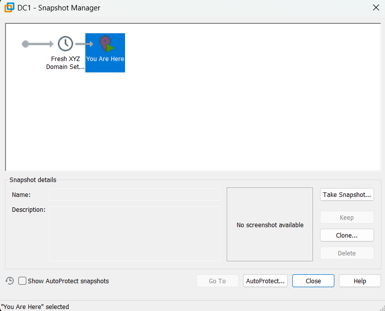
*Snapshot Manager for `DC1` — `Fresh XYZ Domain Set...` snapshot
taken immediately after the domain was configured and verified*

---

### Step 7 — Join the Windows 11 Workstation to the Domain

Before joining, the workstation's DNS was changed to point to
the DC's IP (`192.168.15.155`) — this is **critical**. Without
correct DNS, the workstation cannot locate the domain.

**On the Windows 11 workstation:**

Settings → Network & Internet → Ethernet → DNS Server Assignment
→ Manual → IPv4 DNS: `192.168.15.155`

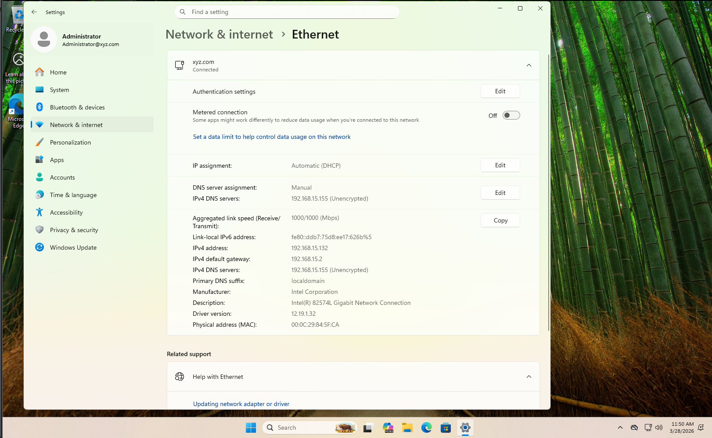
*Workstation Ethernet settings confirming DNS is manually set to
`192.168.15.155` (the DC). IP address `192.168.15.132` obtained
via DHCP. Connected network shows `xyz.com`*

The workstation was then joined to the domain via:

Settings → System → About → Advanced system settings
→ Computer Name tab → Change → Domain: `xyz.com`
→ Enter domain admin credentials → Restart

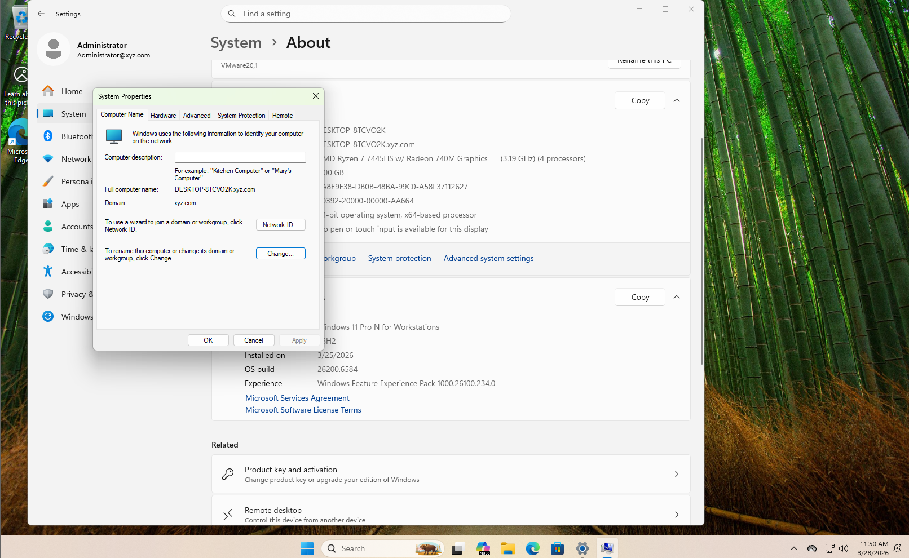
*System Properties confirming `DESKTOP-8TCVO2K` is joined to the
`xyz.com` domain. Full computer name: `DESKTOP-8TCVO2K.xyz.com`.
Logged in as `Administrator@xyz.com`*

After joining, the Windows 11 login screen shows the domain:

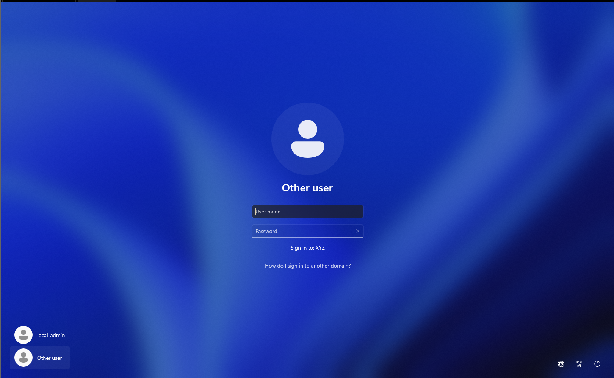
*Windows 11 login screen showing `Sign in to: XYZ` — confirming
the workstation is domain-joined. Both `local_admin` (local account)
and `Other user` (domain login) options are visible*

---

### Step 8 — Take a Snapshot of the Workstation

After successfully joining the domain:

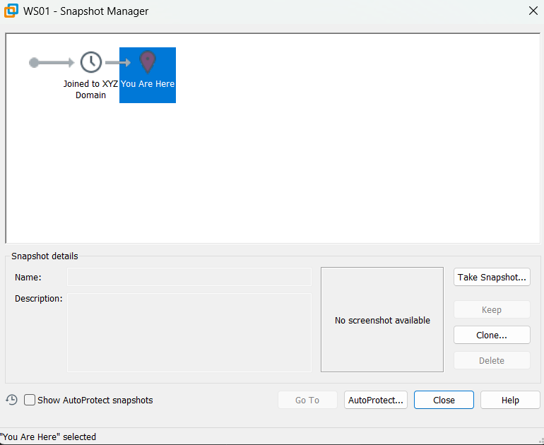
*Snapshot Manager for `WS01` — `Joined to XYZ Domain` snapshot
taken after the workstation successfully joined `xyz.com`*

---

## 🖼️ Screenshots Summary

| # | File | Description |
|---|---|---|
| 1 | `screenshots/01-dc-hostname.png` | DC hostname confirmed as `DC1` |
| 2 | `screenshots/02-dc-static-ip.png` | Static IP `192.168.15.155`, DNS = self |
| 3 | `screenshots/03-sconfig-menu.png` | sconfig showing DC1 in xyz.com domain |
| 4 | `screenshots/04-adds-installed.png` | AD DS role install state = Installed |
| 5 | `screenshots/05-get-addomain.png` | Get-ADDomain confirming xyz.com forest |
| 6 | `screenshots/06-domain-computers-users.png` | DC1 + DESKTOP-8TCVO2K in domain |
| 7 | `screenshots/06-domain-computers-users-02.png` | Full domain user list |
| 8 | `screenshots/07-workstation-domain-joined.png` | Workstation joined to xyz.com |
| 9 | `screenshots/08-workstation-dns-settings.png` | Workstation DNS = 192.168.15.155 |
| 10 | `screenshots/09-domain-login-screen.png` | Login screen showing Sign in to: XYZ |
| 11 | `screenshots/10-dc-snapshot.png` | DC1 Fresh XYZ Domain snapshot |
| 12 | `screenshots/11-ws-snapshot.png` | WS01 Joined to XYZ Domain snapshot |

---

## 🧩 Key Takeaways

- The **Domain Controller must have a static IP** — if it changes,
  all domain-joined machines lose the ability to authenticate.
- The **DC points DNS to itself** because it runs its own DNS
  server to resolve domain names within the `xyz.com` network.
- **Workstations must have their DNS set to the DC's IP** before
  joining — this is the most common mistake beginners make.
- `Install-ADDSForest` creates a brand new AD forest from scratch —
  not just a domain role, but the entire AD infrastructure.
- The `krbtgt` account is the backbone of **Kerberos authentication**
  and will become significant when studying Golden Ticket attacks.
- **Snapshots at key milestones** (after DC promotion, after domain
  join) let you safely experiment and revert without losing progress.

---

## ➡️ Next Chapter

[Chapter 2 — Coming Soon](../Chapter-2/README.md)