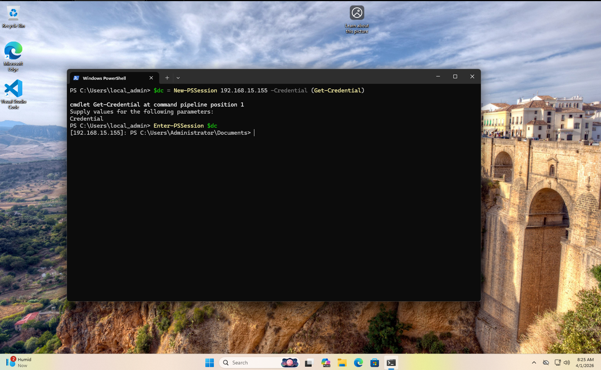
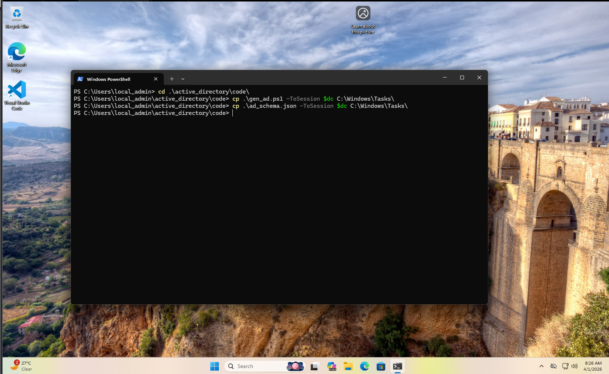
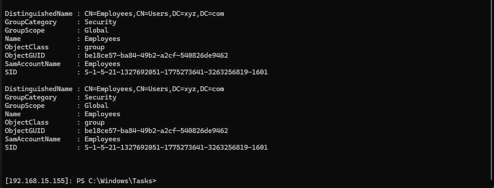
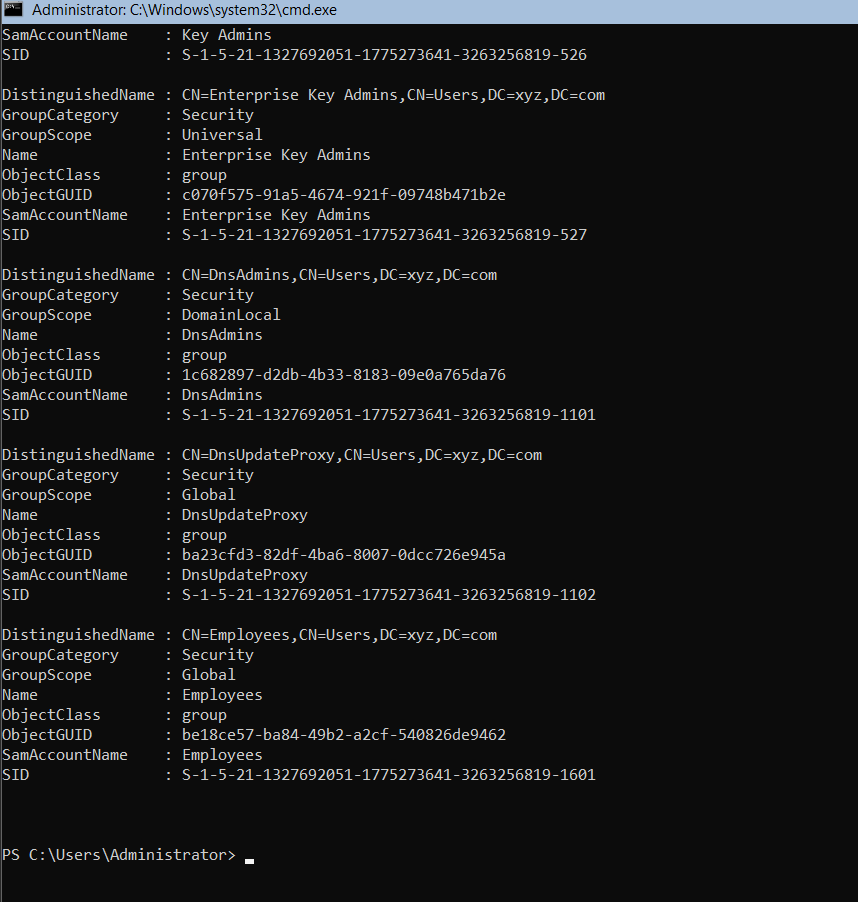
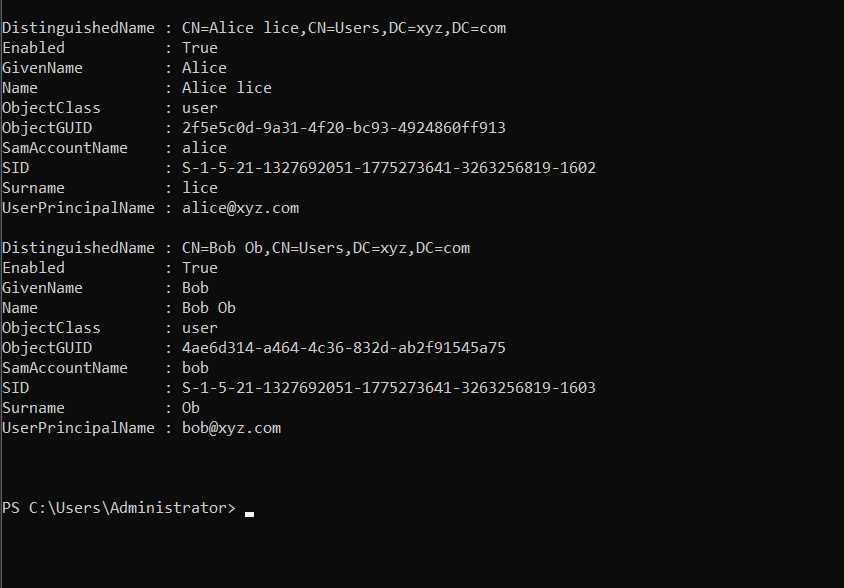
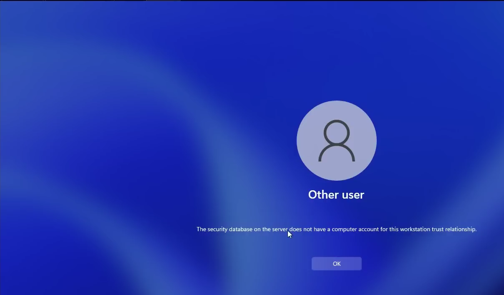
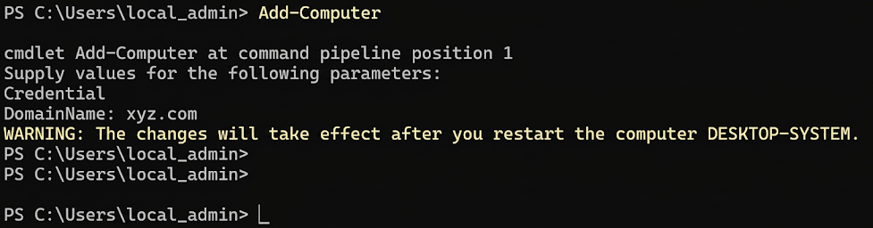
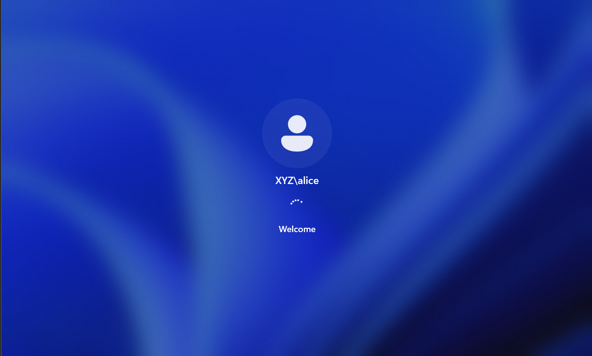

# Chapter 2 — Automating Domain Users & Groups

> **Based on:** [Automating DOMAIN USERS (Active Directory #02)](https://www.youtube.com/watch?v=59VqS6wMn6w&list=PL1H1sBF1VAKVoU6Q2u7BBGPsnkn-rajlp&index=3) by John Hammond

---

## Overview

In this chapter, we move away from manually managing Active Directory objects and adopt an **infrastructure-as-code** approach. Using a JSON schema file and a custom PowerShell script, we automate the creation of AD groups and users — making the lab environment reproducible, extensible, and ready for future security tooling like BloodHound and PowerView.

---

## Key Concepts

| Concept | Description |
|---|---|
| AD Schema JSON | A config file that defines the domain, groups, users, and group memberships — the single source of truth |
| `New-ADGroup` | PowerShell cmdlet to programmatically create AD security groups |
| `New-ADUser` | PowerShell cmdlet to create domain user accounts with generated attributes |
| `Add-ADGroupMember` | Assigns users to their respective groups |
| Try/Catch error handling | Prevents the script from crashing if a group/user already exists |
| `Copy-Item -ToSession` | Transfers files from the local machine into a remote PS session |
| Trust Relationship Error | Occurs when a workstation's machine account loses sync with the DC — fixed by re-joining the domain |

---

## Scripts

### `ad_schema.json` — AD Schema Configuration

This JSON file acts as the blueprint for the entire AD environment. Add users, groups, and memberships here — the script handles the rest.
```json
{
    "domain": "xyz.com",
    "groups" : [
        {
            "name": "Employees"
        }
    ],

    "users": [

        {
            "name": "Alice lice",
            "password": "P@ssw0rd789",
            "groups": [
                "Employees"
            ]
        },

        {
            "name": "Bob Ob",
            "password": "P@sswordABC",
            "groups": [
                "Employees"
            ]
        }
    ]
}
```

---

### `gen_ad.ps1` — AD Generation Script

This script parses the JSON schema and creates all defined groups and users on the Domain Controller.
```powershell
param ( [Parameter(Mandatory=$true)] $JSONFile)

function CreateADGroup {
    param ( [Parameter(Mandatory=$true)] $groupObject)

    $name = $groupObject.name
    
    New-ADGroup -name $name -GroupScope Global
}

function CreateADUser() {
    param ( [Parameter(Mandatory=$true)] $userObject)

    # Pull out the name from the JSON object
    $name = $userObject.name
    $password = $userObject.password

    # Generate a "first initial, last name" structure for username
    $firstname, $lastname = $name.Split(" ")
    $username = ($firstname[0] + $lastname).ToLower()
    $samAccountName = $username
    $principalname = $username

    # Actually create the AD user object
    New-ADUser -Name "$name" `
               -GivenName $firstname `
               -Surname $lastname `
               -SamAccountName $samAccountName `
               -UserPrincipalName $principalname@$Global:Domain `
               -AccountPassword (ConvertTo-SecureString $password -AsPlainText -Force) `
               -PassThru | Enable-ADAccount

    # Add the user to its appropriate group
    foreach ($group_name in $userObject.groups) {
        try {
            Get-ADGroup -Identity "$group_name"
            Add-ADGroupMember -Identity $group_name -Members $username
        }
        catch [Microsoft.ActiveDirectory.Management.ADIdentityNotFoundException] {
            Write-Warning "User $name NOT added to group $group_name because it does not exist"
        }
    }
}

$json = (Get-Content $JSONFile | ConvertFrom-Json)

$Global:Domain = $json.domain

foreach ($group in $json.groups) {
    CreateADGroup $group
}

foreach ($user in $json.users) {
    CreateADUser $user
}
```

> 💡 **Username Convention:** The script generates usernames using a `first initial + last name` pattern. For example, `Alice lice` → `alice`, and `Bob Ob` → `bob`. These become the `SamAccountName` and `UserPrincipalName` (e.g., `alice@xyz.com`).

---

## Step-by-Step Walkthrough

### Step 1 — Establish a Remote PS Session to DC1

From the WS01 workstation, create a persistent PS session variable pointing to the DC, then enter it.
```powershell
# Create session object (prompts for credentials)
$dc = New-PSSession 192.168.15.155 -Credential (Get-Credential)

# Enter the remote session
Enter-PSSession $dc
```



> 💡 **Why store the session in `$dc`?** Saving the session as a variable lets you reuse it for file transfers (`Copy-Item -ToSession $dc`) without opening a second connection.

---

### Step 2 — Transfer Scripts to the Domain Controller

Navigate to the local script directory and copy both files into the DC's `C:\Windows\Tasks\` folder via the session.
```powershell
cd .\active_directory\code\

cp .\gen_ad.ps1     -ToSession $dc C:\Windows\Tasks\
cp .\ad_schema.json -ToSession $dc C:\Windows\Tasks\
```



---

### Step 3 — Execute the Script on DC1

From inside the remote session on DC1, run the script and pass the JSON schema as the argument.
```powershell
# Set execution policy to allow script execution
Set-ExecutionPolicy -ExecutionPolicy Bypass -Scope Process

# Run the generation script
.\gen_ad.ps1 -JSONFile .\ad_schema.json
```



> ⚠️ **Note:** The `Employees` group appears twice in the screenshot above — this is because the script was run twice during testing. The second run hit the `New-ADGroup` call again, but since error handling on the group side will vary depending on script version, running it on a clean slate is the safest approach.

---

### Step 4 — Verify Groups Were Created
```powershell
Get-ADGroup -Filter *
```



The `Employees` group is confirmed in the output alongside the default domain groups (`Domain Admins`, `DnsAdmins`, etc.), with a SID of `S-1-5-21-...-1601`.

---

### Step 5 — Verify Users Were Created
```powershell
Get-ADUser -Filter *
```



Both `alice` and `bob` are created, enabled, and have correct `UserPrincipalName` values (`alice@xyz.com`, `bob@xyz.com`).

---

### Step 6 — Trust Relationship Error (Troubleshooting)

Attempting to log into WS01 as `alice` immediately produced this error:

> *"The security database on the server does not have a computer account for this workstation trust relationship."*



**Why does this happen?**

Every domain-joined machine holds a **machine account** in AD with a periodically rotating password shared with the DC. If the workstation's secure channel gets out of sync (e.g., after a snapshot restore or time skew), the DC no longer recognises the machine account and domain logins fail. Local accounts like `local_admin` are unaffected.

---

### Step 7 — Fix: Re-join the Domain

The cleanest fix is to re-join the workstation to the domain. Run the following on WS01 as `local_admin`:
```powershell
Add-Computer
# Prompts for: Credential (use Administrator@xyz.com), DomainName (xyz.com)
# Restart the machine after completion
```



> ⚠️ **Note:** The warning `"The changes will take effect after you restart the computer DESKTOP-SYSTEM"` is expected. Restart WS01 to complete the re-join.

---

### Step 8 — Successful Domain User Login

After restarting, log into WS01 as `XYZ\alice`. The domain authenticates successfully.



The **"Welcome"** screen confirms that `alice` is now a fully functional domain user, authenticated against DC1 via Kerberos.

---

## Commands Reference
```powershell
# Create PS session to DC
$dc = New-PSSession 192.168.15.155 -Credential (Get-Credential)
Enter-PSSession $dc

# Transfer files to DC
cp .\gen_ad.ps1 -ToSession $dc C:\Windows\Tasks\
cp .\ad_schema.json -ToSession $dc C:\Windows\Tasks\

# Run the generation script
Set-ExecutionPolicy -ExecutionPolicy Bypass -Scope Process
.\gen_ad.ps1 -JSONFile .\ad_schema.json

# Verify AD objects
Get-ADGroup -Filter *
Get-ADUser -Filter *

# Re-join domain (to fix trust relationship error)
Add-Computer
```

---

## Domain Users Created

| Full Name | Username | UPN | Group | SID |
|---|---|---|---|---|
| Alice lice | alice | alice@xyz.com | Employees | S-1-5-21-...-1602 |
| Bob Ob | bob | bob@xyz.com | Employees | S-1-5-21-...-1603 |

## Domain Groups Created

| Group Name | Scope | Category | SID |
|---|---|---|---|
| Employees | Global | Security | S-1-5-21-...-1601 |

---


## Key Takeaways

- **Infrastructure as Code** — Defining your AD environment in a JSON file makes it repeatable. Add a user to the JSON, rerun the script, and they're in AD. No GUI, no manual steps.
- **Username generation** — The `first initial + last name` convention (`alice`, `bob`) mirrors real enterprise naming standards and is important context for future enumeration chapters.
- **Try/Catch for idempotency** — The group assignment block won't crash if a group is missing; it warns and continues. Robust scripting for a lab that gets rebuilt often.
- **Trust relationship errors are common** — Snapshot restores are the most frequent cause in a home lab. The fix is always `Add-Computer` to re-register the machine account with the DC.
- **Kerberos auth confirmed** — A successful `XYZ\alice` login proves the full pipeline: JSON → script → AD objects → domain authentication.