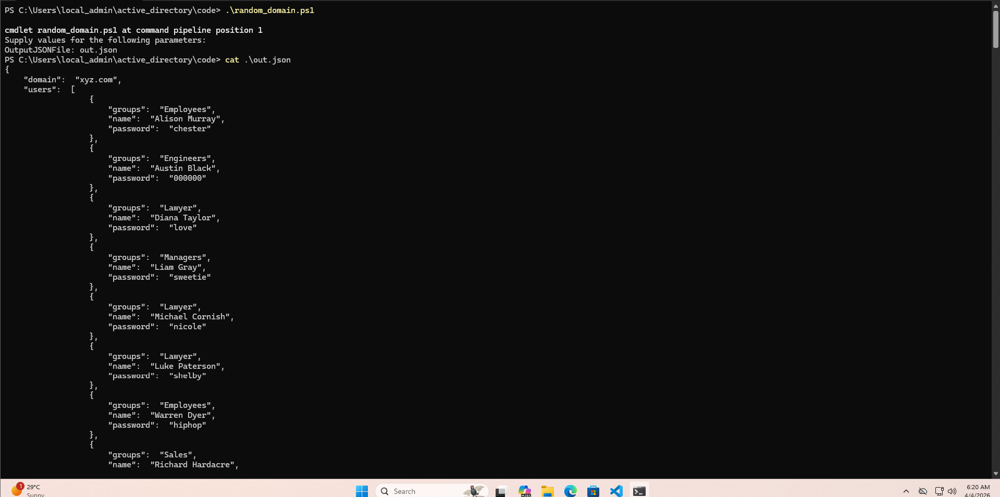
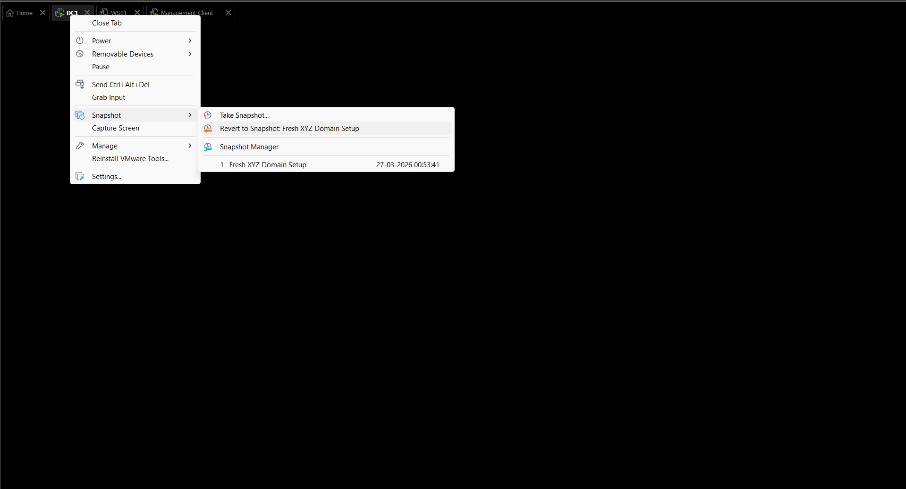
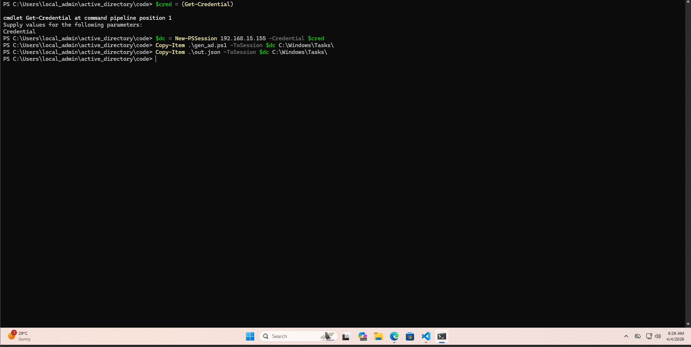
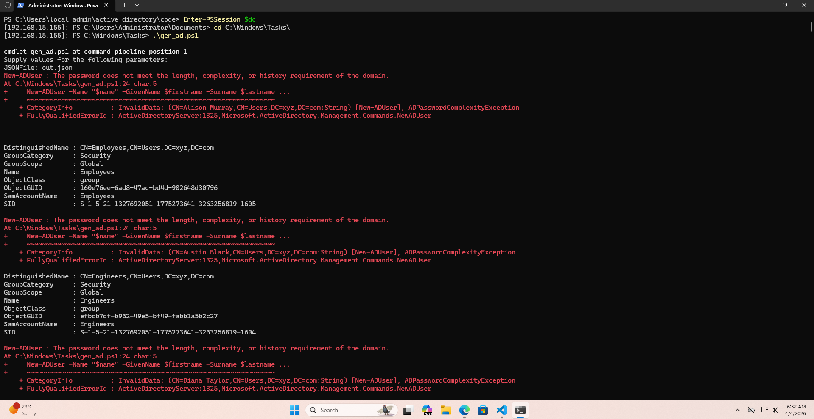
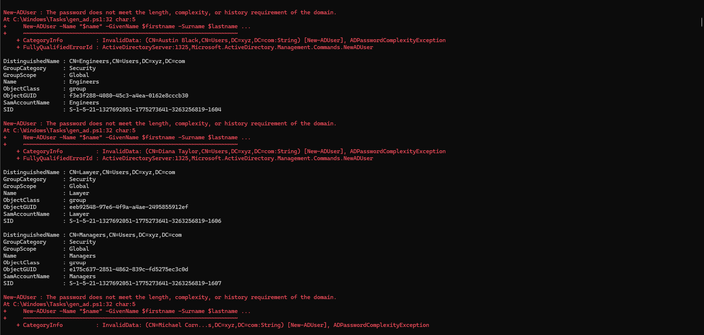
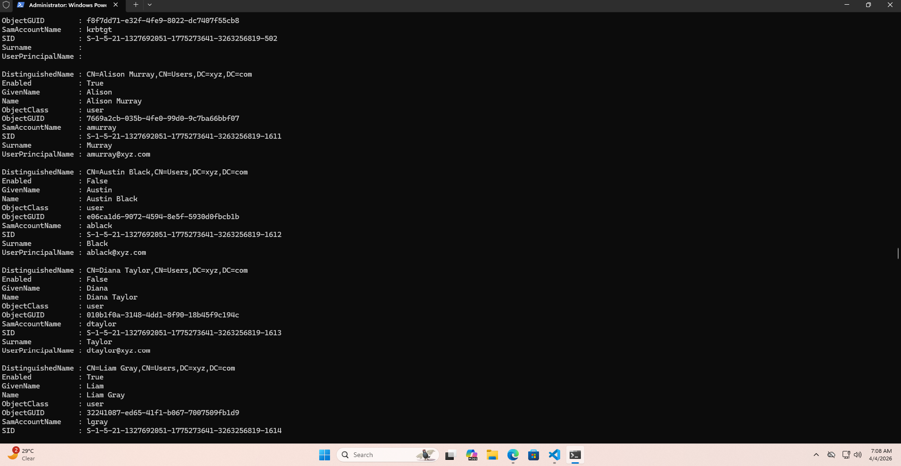
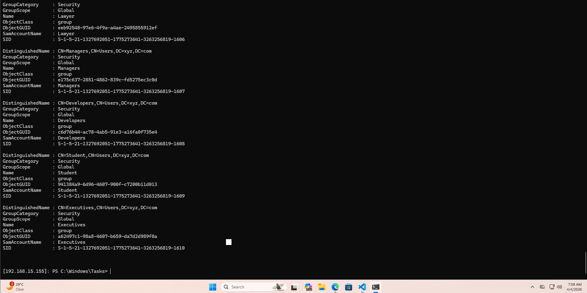
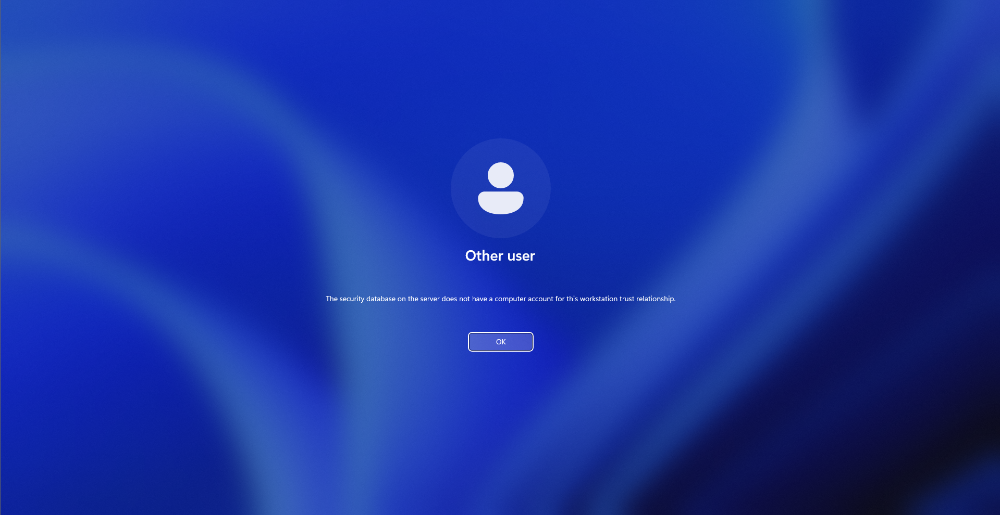
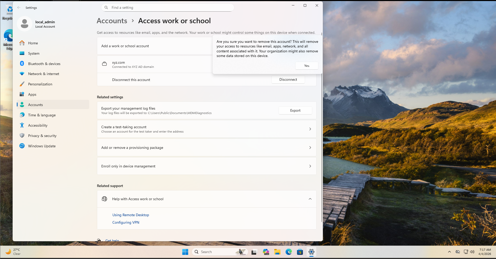
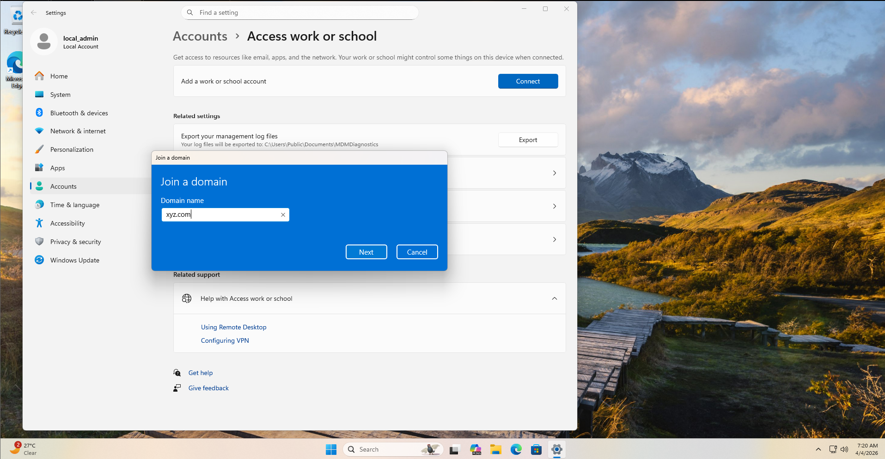

# Chapter 3 — Random Users & Weak Passwords

> **Video:** POWERSHELL: Random Users & Weak Passwords (Active Directory #03)

---

## Overview

In this chapter, we move beyond a hand-crafted static schema and generate a realistic Active Directory environment automatically — 10 random groups and 100 random users, each assigned a weak password drawn from a real-world password list.

Two scripts drive the whole process:

- **`random_domain.ps1`** — runs on the management client; reads dataset files and outputs a randomised `out.json` schema
- **`gen_ad.ps1`** — runs on DC1 via PS remoting; consumes the JSON and creates all AD objects

We also updated `gen_ad.ps1` to disable Windows password complexity policy before creating users, and worked through the trust relationship error that appears every time DC1 is reverted to a snapshot.

---

## Lab Environment

| Component | Details |
|---|---|
| Management Client | Windows 11 — `PS C:\Users\local_admin\active_directory\code` |
| Domain Controller | DC1 — Windows Server 2022 Core — `192.168.15.155` |
| Workstation | WS01 — Windows 11 Pro N — `192.168.15.132` |
| Domain | xyz.com |
| DC Snapshot used | Fresh XYZ Domain Setup (27-03-2026) |

---

## Dataset Files

All datasets live in `code/data/` and are read by `random_domain.ps1` at runtime.

| File | Purpose |
|---|---|
| `first_names.txt` | Pool of first names for random user generation |
| `last_names.txt` | Pool of last names for random user generation |
| `group_names.txt` | Pool of group names to randomly pick from |
| `passwords.txt` | Sanitised weak password list (rockyou.txt subset) |

> 💡 **Why a sanitised password list?** The rockyou.txt wordlist contains real passwords leaked from a 2009 breach. Using a cleaned subset of it gives us realistic weak credentials — exactly the kind that appear in real enterprise environments and are targeted by attacks like Kerberoasting and Password Spraying.

---

## Step 1 — Generate the Random Domain Schema

`random_domain.ps1` randomly picks **10 groups** and **100 users** from the datasets using `Get-Random`. It uses `System.Collections.ArrayList` to ensure no duplicate names or passwords are selected.

```powershell
.\random_domain.ps1 -OutputJSONFile out.json
```

After the script runs, verify the output:

```powershell
cat .\out.json
```



> 💡 **Why `System.Collections.ArrayList`?** Regular PowerShell arrays don't support `.Remove()`. Casting to `ArrayList` allows each selected name or password to be removed from the pool immediately, guaranteeing uniqueness across all 100 users.

### random_domain.ps1

```powershell
param( [Parameter(Mandatory=$true)] $OutputJSONFile )

$group_names = [System.Collections.ArrayList](Get-Content "data/group_names.txt")
$first_names = [System.Collections.ArrayList](Get-Content "data/first_names.txt")
$last_names  = [System.Collections.ArrayList](Get-Content "data/last_names.txt")
$passwords   = [System.Collections.ArrayList](Get-Content "data/passwords.txt")

$groups = @()
$num_groups = 10
for ( $i = 0; $i -lt $num_groups; $i++){
    $group_name = (Get-Random -InputObject $group_names)
    $groups += @{ "name" = "$group_name" }
    $group_names.Remove($group_name)
}

$users = @()
$num_users = 100
for ( $i = 0; $i -lt $num_users; $i++){
    $first_name = (Get-Random -InputObject $first_names)
    $last_name  = (Get-Random -InputObject $last_names)
    $password   = (Get-Random -InputObject $passwords)

    $new_user = @{
        "name"     = "$first_name $last_name"
        "password" = "$password"
        "groups"   = @( (Get-Random -InputObject $groups).name )
    }

    $users += $new_user
    $first_names.Remove($first_name)
    $last_names.Remove($last_name)
    $passwords.Remove($password)
}

@{
    "domain" = "xyz.com"
    "groups" = $groups
    "users"  = $users
} | ConvertTo-Json | Out-File $OutputJSONFile
```

---

## Step 2 — Revert DC1 to a Clean Snapshot

Before deploying the new schema, DC1 is reverted to the **Fresh XYZ Domain Setup** snapshot. This wipes all previously created AD objects (including the Chapter 2 users `alice` and `bob`) and gives us a clean domain to work against.



> ⚠️ **Note:** Reverting DC1's snapshot also invalidates WS01's machine account in the domain. This will cause a trust relationship error later — see Step 6.

---

## Step 3 — Copy Files to DC1 and Deploy

From the management client, create a credential object and a reusable PS session to DC1, then copy both `gen_ad.ps1` and `out.json` across.

```powershell
# Store credentials
$cred = (Get-Credential)

# Create PS session
$dc = New-PSSession 192.168.15.155 -Credential $cred

# Copy files to DC
Copy-Item .\gen_ad.ps1 -ToSession $dc C:\Windows\Tasks\
Copy-Item .\out.json   -ToSession $dc C:\Windows\Tasks\
```



> 💡 **Why `$cred` separately?** Splitting `Get-Credential` into its own variable (`$cred`) allows the same credential object to be reused for the PS session without prompting again. Useful when running multiple operations against the same host.

---

## Step 4 — First Run — Password Policy Error

Enter the DC1 session and run the script:

```powershell
Enter-PSSession $dc
cd C:\Windows\Tasks\
.\gen_ad.ps1 -JSONFile out.json
```

The groups are created, but every user creation fails with:

```
New-ADUser : The password does not meet the length, complexity,
or history requirement of the domain.
```



> ⚠️ **Why this happens:** Windows Server enforces password complexity by default — passwords must contain uppercase, lowercase, digits, and special characters. The weak passwords from our dataset don't meet this requirement.

---

## Step 5 — Fix: Add `WeakenPasswordPolicy` to `gen_ad.ps1`

The fix is to disable the domain's password complexity requirement before creating users. This is done with `secedit` — Windows' built-in security policy tool.

The following function was added to `gen_ad.ps1` and is called at the top of the script, before any AD objects are created:

```powershell
function WeakenPasswordPolicy(){
    secedit /export /cfg C:\Windows\Tasks\secpol.cfg
    (Get-Content C:\Windows\Tasks\secpol.cfg).replace("PasswordComplexity = 1", "PasswordComplexity = 0") | Out-File C:\Windows\Tasks\secpol.cfg
    secedit /configure /db c:\windows\security\local.sdb /cfg C:\Windows\Tasks\secpol.cfg /areas SECURITYPOLICY
    rm -Force C:\Windows\Tasks\secpol.cfg -confirm:$false
}
```

> 💡 **How secedit works here:** It exports the current security policy to a `.cfg` file, replaces the complexity flag from `1` to `0`, re-imports the modified policy, then deletes the temp file. This is the same policy you'd configure via `secpol.msc` in a GUI environment.

DC1 is reverted again to a clean snapshot, files are re-copied, and the updated script is run.

### Updated gen_ad.ps1

```powershell
param ( [Parameter(Mandatory=$true)] $JSONFile)

function CreateADGroup {
    param ( [Parameter(Mandatory=$true)] $groupObject)
    $name = $groupObject.name
    New-ADGroup -name $name -GroupScope Global
}

function RemoveADGroup {
    param ( [Parameter(Mandatory=$true)] $groupObject)
    $name = $groupObject.name
    Remove-ADGroup -Identity $name -Confirm:$false
}

function CreateADUser(){
    param ( [Parameter(Mandatory=$true)] $userObject)

    $name     = $userObject.name
    $password = $userObject.password

    $firstname, $lastname = $name.Split(" ")
    $username             = ($firstname[0] + $lastname).ToLower()
    $samAccountName       = $username
    $principalname        = $username

    New-ADUser -Name "$name" -GivenName $firstname -Surname $lastname `
        -SamAccountName $samAccountName `
        -UserPrincipalName $principalname@$Global:Domain `
        -AccountPassword (ConvertTo-SecureString $password -AsPlainText -Force) `
        -PassThru | Enable-ADAccount

    foreach ($group_name in $userObject.groups){
        try {
            Get-ADGroup -Identity "$group_name"
            Add-ADGroupMember -Identity $group_name -Members $username
        }
        catch [Microsoft.ActiveDirectory.Management.ADIdentityNotFoundException] {
            Write-Warning "User $name NOT added to group $group_name because it does not exist"
        }
    }
}

function WeakenPasswordPolicy(){
    secedit /export /cfg C:\Windows\Tasks\secpol.cfg
    (Get-Content C:\Windows\Tasks\secpol.cfg).replace("PasswordComplexity = 1", "PasswordComplexity = 0") | Out-File C:\Windows\Tasks\secpol.cfg
    secedit /configure /db c:\windows\security\local.sdb /cfg C:\Windows\Tasks\secpol.cfg /areas SECURITYPOLICY
    rm -Force C:\Windows\Tasks\secpol.cfg -confirm:$false
}

WeakenPasswordPolicy

$json          = (Get-Content $JSONFile | ConvertFrom-Json)
$Global:Domain = $json.domain

foreach ($group in $json.groups)  { CreateADGroup $group }
foreach ($user  in $json.users)   { CreateADUser  $user  }
```



> ⚠️ **Still some disabled accounts:** Disabling complexity alone is not enough — the domain also enforces a **minimum password length** (default: 7 characters). Passwords shorter than 7 characters still fail. The user object gets created but is left **Disabled**. This will be addressed in a future chapter.

---

## Step 6 — Verify Users and Groups

### Users

```powershell
Get-ADUser -Filter *
```



| SamAccountName | Full Name | Enabled |
|---|---|---|
| amurray | Alison Murray | True |
| ablack | Austin Black | False |
| dtaylor | Diana Taylor | False |
| lgray | Liam Gray | True |

Accounts with `Enabled: False` had passwords that were too short — the complexity requirement was removed but the minimum length was not. Their objects exist in AD but cannot be logged into until the password is updated.

### Groups

```powershell
Get-ADGroup -Filter *
```



All 10 randomly selected groups were successfully created, each as a Global Security group.

---

## Step 7 — Trust Relationship Error on WS01

Attempting to log in from WS01 as one of the new domain users immediately fails:

> *The security database on the server does not have a computer account for this workstation trust relationship.*



> ⚠️ **Why this happens:** When DC1 was reverted to a snapshot, its copy of WS01's machine account was rolled back to the state at snapshot time. WS01 and DC1 are now out of sync — the domain no longer recognises WS01's computer account. The fix is to leave and rejoin the domain.

---

## Step 8 — Disconnect WS01 from the Domain

Log in to WS01 as `local_admin` (local account — not affected by the domain issue).

Navigate to: **Settings → Accounts → Access work or school**

Click **Disconnect** on the `xyz.com` entry and confirm.



Reboot WS01 when prompted.

---

## Step 9 — Rejoin WS01 to the Domain

After rebooting, navigate back to: **Settings → Accounts → Access work or school → Connect**

In the dialog, choose **Join this device to a local Active Directory domain** and enter `xyz.com`.



Authenticate with domain Administrator credentials, then reboot.

---

## Step 10 — Confirm Domain Login with New User

After rebooting, select **Other user** at the login screen and log in with one of the newly created enabled domain accounts.


Login successful. The randomly generated AD environment is working.

---

## Key Commands — Summary

```powershell
# Generate random schema (management client)
.\random_domain.ps1 -OutputJSONFile out.json
cat .\out.json

# Set up PS session and copy files
$cred = (Get-Credential)
$dc   = New-PSSession 192.168.15.155 -Credential $cred
Copy-Item .\gen_ad.ps1 -ToSession $dc C:\Windows\Tasks\
Copy-Item .\out.json   -ToSession $dc C:\Windows\Tasks\

# Enter DC and run
Enter-PSSession $dc
cd C:\Windows\Tasks\
.\gen_ad.ps1 -JSONFile out.json

# Verify
Get-ADUser  -Filter *
Get-ADGroup -Filter *
```

---

## Key Concepts

| Concept | Explanation |
|---|---|
| `Get-Random` | PowerShell cmdlet for randomly selecting elements from a collection |
| `System.Collections.ArrayList` | .NET type that supports `.Remove()` — ensures no duplicate selections across 100 users |
| `secedit` | Windows CLI tool for exporting, modifying, and re-applying security policy |
| Password complexity vs minimum length | Two separate policy settings — disabling complexity does not remove the minimum length requirement |
| DC snapshot revert | Wipes all AD objects back to the snapshot state — fastest lab reset method |
| DC revert breaks WS machine account | Any DC revert invalidates the workstation's computer account; domain rejoin required |
| Weak password simulation | Using real-world leaked passwords to build a realistic target for future attack exercises |

---

## Known Issues

| Issue | Status |
|---|---|
| Some user accounts created as Disabled | ⚠️ Passwords below minimum length threshold — to be fixed in a future chapter |
| `out.json` committed with plaintext passwords | ⚠️ Consider adding to `.gitignore` or redacting password values before pushing to GitHub |

---

## Screenshots

| # | File | Description |
|---|---|---|
| 1 | 01-running_script_on_management_client.png | random_domain.ps1 running; out.json output showing random users, groups, passwords |
| 2 | 02-dc1_reverting_back.png | VMware snapshot menu — reverting DC1 to Fresh XYZ Domain Setup |
| 3 | 03-copying_script_json_to_dc1.png | $cred + $dc PSSession; Copy-Item transferring gen_ad.ps1 and out.json to DC |
| 4 | 04-password_policy_error.png | First run — ADPasswordComplexityException; Employees + Engineers groups created |
| 5 | 05-dc1_gen_ad_script.png | Second run after WeakenPasswordPolicy fix — remaining groups created |
| 6 | 06-get-aduser-100-users.png | Get-ADUser — ~100 users; mixed Enabled/Disabled |
| 7 | 07-get-adgroup.png | Get-ADGroup — all 10 random groups confirmed |
| 8 | 08-new_user_not_login.png | Trust relationship error on WS01 |
| 9 | 09-disconnecting_the_ws01.png | Disconnecting WS01 from xyz.com via Settings |
| 10 | 10-rejoining_the_domain.png | Rejoining WS01 to xyz.com via Settings |
| 11 | 11-login-of-newuser.png | Successful domain login with new random user |

---

*Next: Chapter 4 — fixing disabled accounts by also removing the minimum password length requirement.*