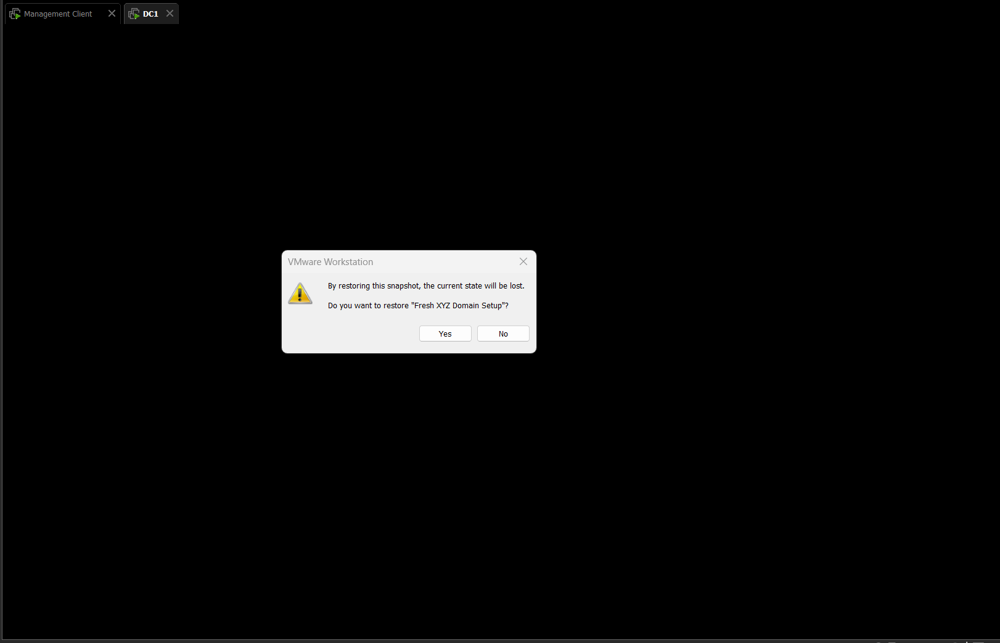
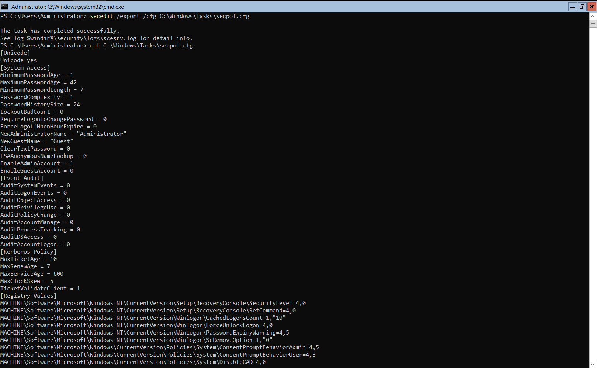
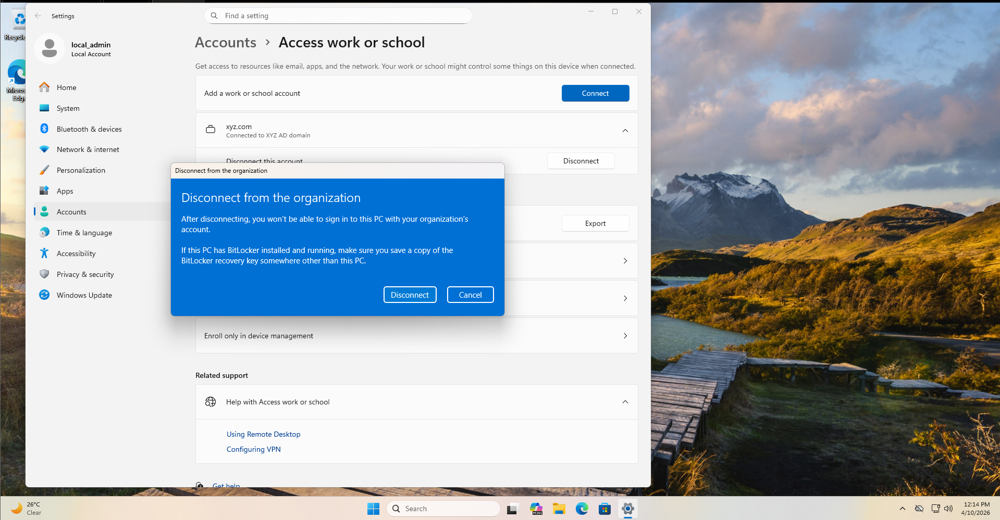
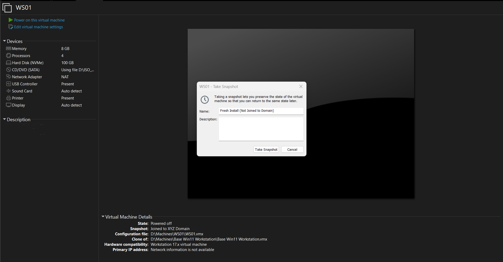
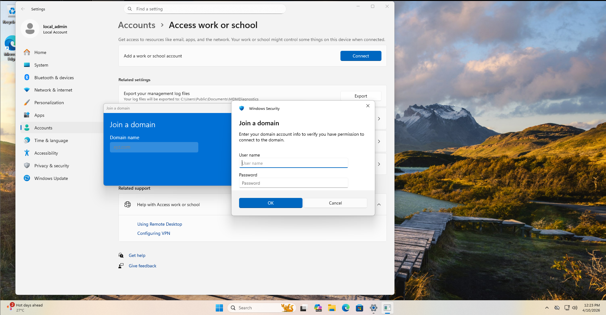
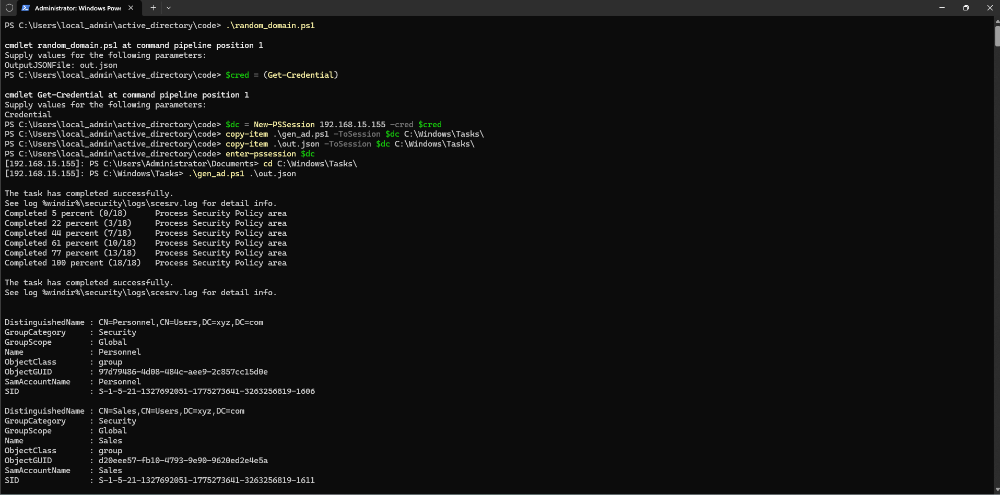
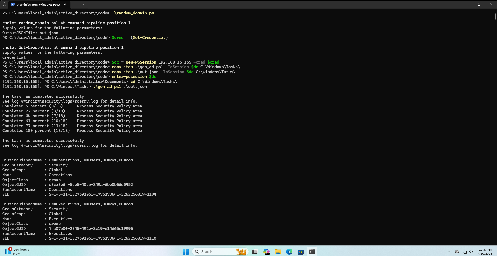
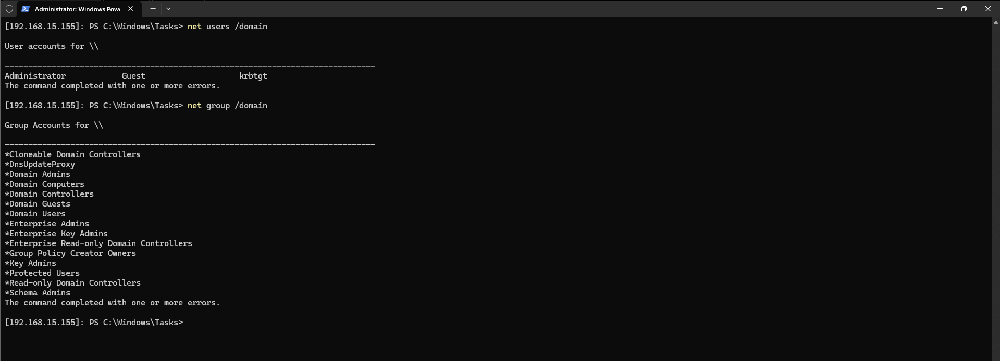

# Chapter 4 — Tearing Down the Domain Controller

> **Based on:** TEARING DOWN the DOMAIN CONTROLLER (Active Directory #04) by [John Hammond](https://www.youtube.com/@_JohnHammond)

---

## Overview

Chapter 3 left two unresolved problems. First, reverting DC1 to a snapshot would break WS01's domain trust, meaning domain users could no longer log in. Second, the `WeakenPasswordPolicy` function only disabled password complexity but left the minimum length requirement at 7 characters — silently creating disabled accounts for any user whose randomly generated password was too short.

Chapter 4 fixes both issues and introduces a full teardown workflow, making the lab reliably repeatable: revert DC1, rebuild the domain, verify, revert again, and repeat — without touching WS01.

---

## Key Changes

- **Fixed `WeakenPasswordPolicy`** — now patches both `PasswordComplexity` and `MinimumPasswordLength` in a single pass
- **Added `StrengthenPasswordPolicy`** — restores the original policy values on teardown
- **Added `RemoveADUser` and `RemoveADGroup`** — clean deletion of all generated objects
- **Added `-Undo` switch** — single script, two modes: build or tear down
- **New snapshot strategy** — DC1 snapshot taken *after* WS01 successfully joins, so reverting never breaks the trust relationship again

---

## Steps Performed

### Step 1 — Revert DC1 to Clean Snapshot

DC1 was reverted to the `Fresh XYZ Domain Setup` snapshot to start from a clean domain with no leftover users or groups from Chapter 3.



---

### Step 2 — Inspect the Current Password Policy

Before editing the script, the existing policy was exported and read directly on DC1 to confirm the exact field names and current values.

```powershell
secedit /export /cfg C:\Windows\Tasks\secpol.cfg
cat C:\Windows\Tasks\secpol.cfg
```



The output confirmed:

```
MinimumPasswordLength = 7
PasswordComplexity = 1
```

This was the root cause of the disabled accounts in Chapter 3 — complexity was being disabled but the minimum length of 7 was untouched, silently rejecting short passwords from `passwords.txt`.

> 💡 **Why does this matter?** `PasswordComplexity` and `MinimumPasswordLength` are two completely independent policy settings. Disabling complexity alone does not remove the length floor. Any password shorter than the minimum is rejected at account creation — the user object is still created, but left in a `Disabled` state with no error surfaced to the script.

---

### Step 3 — Update `gen_ad.ps1`

Three categories of changes were made to the script.

#### Fix: `WeakenPasswordPolicy` now patches both settings

```powershell
function WeakenPasswordPolicy(){
    secedit /export /cfg C:\Windows\Tasks\secpol.cfg
    (Get-Content C:\Windows\Tasks\secpol.cfg).replace("PasswordComplexity = 1", "PasswordComplexity = 0").replace("MinimumPasswordLength = 7", "MinimumPasswordLength = 1") | Out-File C:\Windows\Tasks\secpol.cfg
    secedit /configure /db c:\windows\security\local.sdb /cfg C:\Windows\Tasks\secpol.cfg /areas SECURITYPOLICY
    rm -Force C:\Windows\Tasks\secpol.cfg -confirm:$false
}
```

Both `.replace()` calls are chained on the same `Get-Content` read — the file is read once, patched twice in memory, then written back.

#### New: `StrengthenPasswordPolicy` — exact inverse

```powershell
function StrengthenPasswordPolicy(){
    secedit /export /cfg C:\Windows\Tasks\secpol.cfg
    (Get-Content C:\Windows\Tasks\secpol.cfg).replace("PasswordComplexity = 0", "PasswordComplexity = 1").replace("MinimumPasswordLength = 1", "MinimumPasswordLength = 7") | Out-File C:\Windows\Tasks\secpol.cfg
    secedit /configure /db c:\windows\security\local.sdb /cfg C:\Windows\Tasks\secpol.cfg /areas SECURITYPOLICY
    rm -Force C:\Windows\Tasks\secpol.cfg -confirm:$false
}
```

Called during teardown to restore the domain to its default hardened policy before removal of objects.

#### New: `RemoveADUser` and `RemoveADGroup`

```powershell
function RemoveADUser(){
    param ( [Parameter(Mandatory=$true)] $userObject)

    $name = $userObject.name
    $firstname, $lastname = $name.Split(" ")
    $username = ($firstname[0] + $lastname).ToLower()
    $samAccountName = $username
    Remove-ADUser -Identity $samAccountName -Confirm:$false
}

function RemoveADGroup {
    param ( [Parameter(Mandatory=$true)] $groupObject)

    $name = $groupObject.name
    Remove-ADGroup -Identity $name -Confirm:$false
}
```

`RemoveADUser` derives the `SamAccountName` using the same first-initial-plus-lastname logic as `CreateADUser`, so no extra data is needed in the JSON. `-Confirm:$false` suppresses interactive prompts in both functions.

#### New: `-Undo` switch and branched execution

```powershell
param ( [Parameter(Mandatory=$true)] $JSONFile, [switch]$Undo)
```

```powershell
if (-not $Undo){

    WeakenPasswordPolicy

    foreach ($group in $json.groups){
        CreateADGroup $group
    }
    foreach ($user in $json.users){
        CreateADUser $user
    }

} else {

    StrengthenPasswordPolicy

    foreach ($user in $json.users){
        RemoveADUser $user
    }
    foreach ($group in $json.groups){
        RemoveADGroup $group
    }
}
```

> 💡 **Order matters in teardown.** Users are removed *before* groups. This ensures groups are empty before deletion, avoiding dependency conflicts.

---

### Step 4 — Disconnect WS01 from the Domain

Before taking a clean WS01 snapshot, it was disconnected from `xyz.com` via Settings → Accounts → Access work or school → Disconnect.



---

### Step 5 — Snapshot WS01 (Fresh Install, Not Joined to Domain)

With WS01 disconnected, a new snapshot was taken as a pre-join baseline.



**Snapshot name:** `Fresh Install (Not Joined to Domain)`

---

### Step 6 — Rejoin WS01 to the Domain

WS01 was rejoined to `xyz.com` via Settings → Accounts → Access work or school → Connect → Join a domain.



> 💡 **Why disconnect and rejoin?** After the DC1 revert in Step 1, WS01's machine account was invalidated (same trust relationship issue seen in Chapters 2 and 3). A clean disconnect-and-rejoin re-establishes a fresh machine account in the domain.

---

### Step 7 — Snapshot WS01 (Joined to XYZ Domain)

After a successful rejoin, a second snapshot was taken.

**Snapshot name:** `Joined to XYZ Domain`

---

### Step 8 — Snapshot DC1 (WS01 Joined to Domain)

With WS01 successfully joined, a snapshot was taken of DC1 at this exact state.

**Snapshot name:** `WS01 Joined to Domain`

> 💡 **This is the key insight of Chapter 4.** By capturing DC1's state *after* WS01 has joined, reverting DC1 to this snapshot preserves the machine account. WS01 never loses its trust relationship, and domain logins continue to work — no rejoin needed after a revert.

---

### Step 9 — Run Script and Verify (First Run)

From the management client, `random_domain.ps1` was run to generate a fresh `out.json`, then `gen_ad.ps1` and `out.json` were copied to DC1 and executed.

```powershell
.\random_domain.ps1 -OutputJSONFile out.json

$cred = (Get-Credential)
$dc = New-PSSession 192.168.15.155 -Credential $cred

copy-item .\gen_ad.ps1 -ToSession $dc C:\Windows\Tasks\
copy-item .\out.json   -ToSession $dc C:\Windows\Tasks\

enter-pssession $dc

cd C:\Windows\Tasks\
.\gen_ad.ps1 .\out.json
```



`WeakenPasswordPolicy` applied successfully (secedit: 0% → 100%). Groups `Personnel` and `Sales` visible in output.

---

### Step 10 — Verify Domain Login (First Run)

Logged into WS01 as a newly created domain user.


**Result: ✅ Domain login successful.**

---

### Step 11 — Revert DC1 and Rebuild (Second Run)

DC1 was reverted to the `WS01 Joined to Domain` snapshot — the new one created in Step 8. The same pipeline was run again with a freshly generated `out.json`.



A different random set of groups was generated this time (`Operations`, `Executives`), confirming `random_domain.ps1` is producing varied output each run.

---

### Step 12 — Verify Domain Login (Second Run)

Logged into WS01 as a different newly created domain user.


**Result: ✅ Domain login successful — without touching WS01 between runs.**

This confirms the new snapshot strategy works. DC1 can be reverted and rebuilt repeatedly with no impact on WS01's domain membership.

---

### Step 13 — Tear Down with `-Undo`

The updated `gen_ad.ps1` was copied to DC1 and run with the `-Undo` flag to delete all generated users and groups and restore the password policy.

```powershell
copy-item .\gen_ad.ps1 -ToSession $dc C:\Windows\Tasks\
enter-pssession $dc
cd C:\Windows\Tasks\
.\gen_ad.ps1 .\out.json -Undo
```

`net users /domain` and `net group /domain` were run to confirm the domain was clean.



`net users /domain` returned only `Administrator`, `Guest`, and `krbtgt` — all 100 generated users removed. `net group /domain` returned only built-in groups — all custom groups removed.

**Result: ✅ Full teardown successful.**

---

## Final Snapshot State

| VM | Snapshot | Purpose |
|---|---|---|
| DC1 | `Fresh XYZ Domain Setup` | Clean domain, no WS01 machine account |
| DC1 | `WS01 Joined to Domain` | ✅ New — DC state after WS01 joined; safe revert point |
| WS01 | `Fresh Install` | Pre-domain baseline |
| WS01 | `Fresh Install (Not Joined to Domain)` | ✅ New — post-disconnect clean baseline |
| WS01 | `Joined to XYZ Domain` | ✅ New — WS01 joined; matches DC1 `WS01 Joined to Domain` |

---

## Scripts Reference

| File | Change | Purpose |
|---|---|---|
| `code/gen_ad.ps1` | ✅ Updated | Added `-Undo` switch, `RemoveADUser`, `RemoveADGroup`, `StrengthenPasswordPolicy`; fixed `WeakenPasswordPolicy` to also patch `MinimumPasswordLength` |
| `code/random_domain.ps1` | No change | Random schema generator — unchanged from Chapter 3 |
| `code/out.json` | Regenerated | Fresh random output from this chapter's run |

---

## Key Concepts Learned

**Snapshot timing is everything** — a DC snapshot taken after a workstation joins the domain captures the machine account. Reverting to that point keeps the trust relationship intact. The order of snapshot creation is what determines whether a revert breaks workstation authentication or not.

**`PasswordComplexity` and `MinimumPasswordLength` are independent** — disabling complexity does not change the length floor. Both must be explicitly patched to allow short passwords from a wordlist like `rockyou.txt`. Accounts created with a password below the minimum length are silently left `Disabled` with no script-level error.

**`[switch]` parameters in PowerShell** — a `[switch]` is a boolean flag that defaults to `$false`. Passing `-Undo` on the command line sets it to `$true`. This pattern lets a single script handle opposing workflows without duplicating logic.

**Teardown order matters** — when removing AD objects, users must be deleted before groups. Attempting to delete a group that still has members can cause errors depending on group type and protection settings.

**`secedit` is the only way to modify domain password policy from the CLI on Server Core** — there is no `Set-ADDefaultDomainPasswordPolicy` equivalent that touches complexity and length directly; `secedit` export → edit → reimport is the correct approach.

---

## ⚠️ Known Issues

| Issue | Status |
|---|---|
| `StrengthenPasswordPolicy` hardcodes `MinimumPasswordLength = 7` as the restore value | ⚠️ Known — this assumes the DC default was 7, confirmed via screenshot in Step 2. Not a dynamic restore. |

---

## What's Next

| Chapter | Expected Topic |
|---|---|
| Chapter 5 | BloodHound — AD enumeration and attack path mapping |
| Future | Kerberoasting |
| Future | Pass-the-Hash / Pass-the-Ticket |
| Future | Golden Ticket Attack |
| Future | Privilege Escalation in AD |